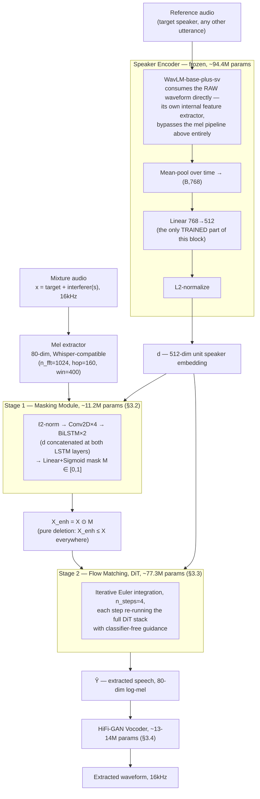
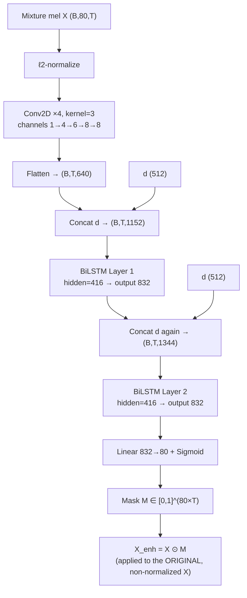
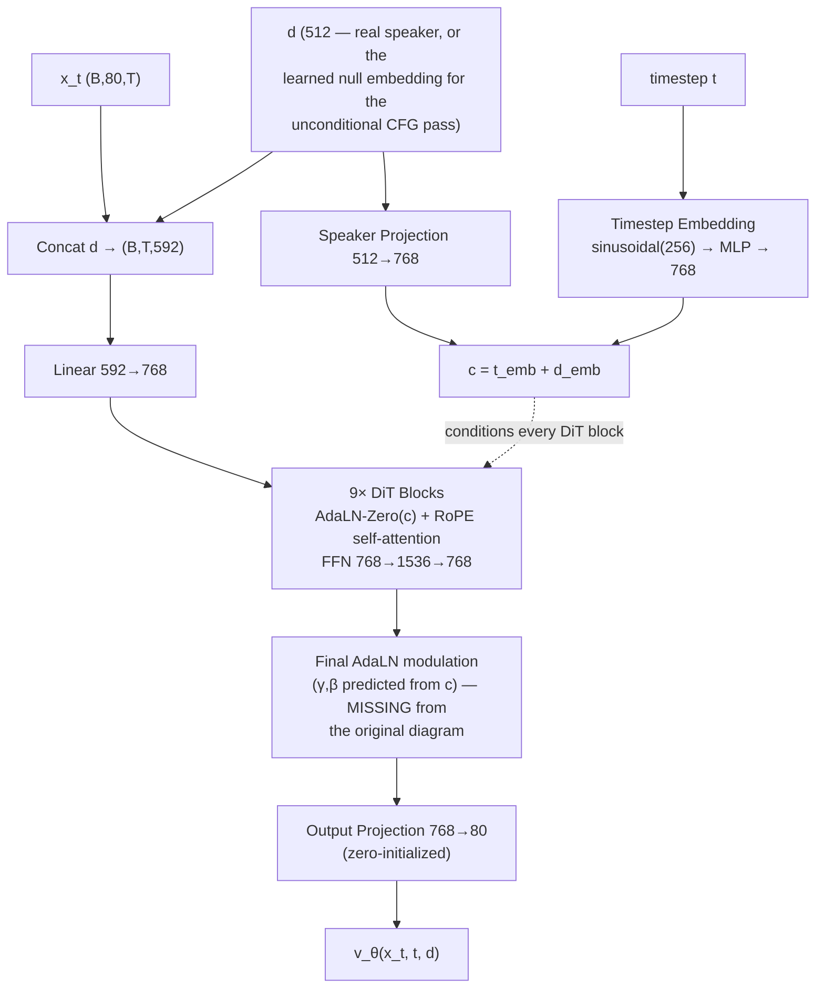
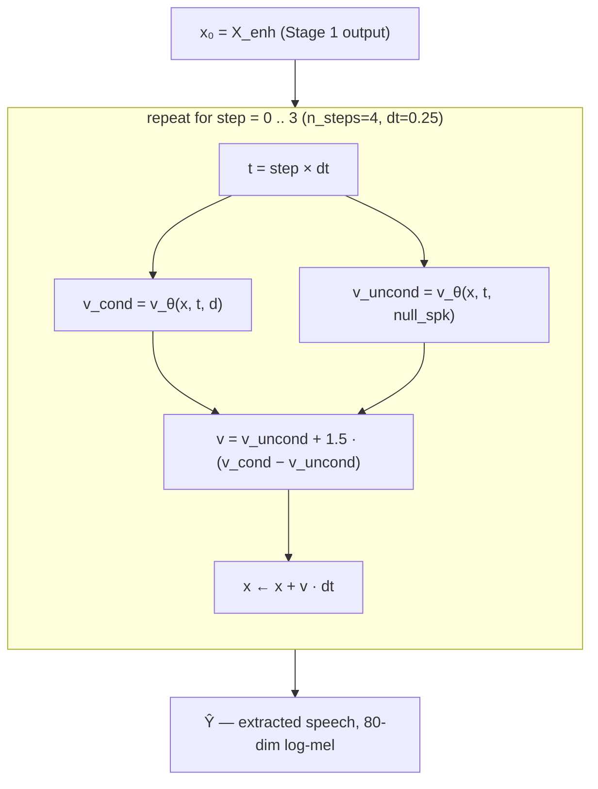
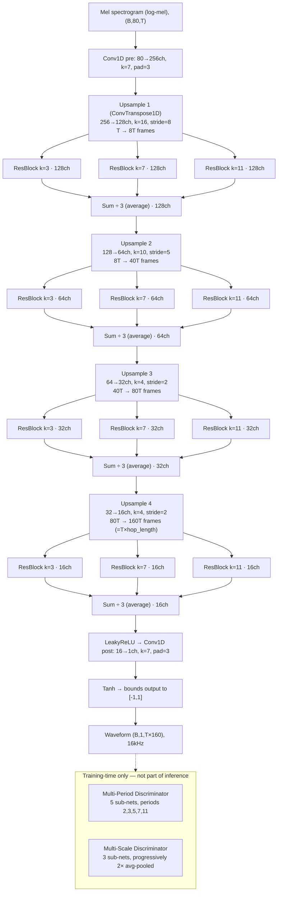

# Mask2Flow-TSE — Introduction, Related Work, Methodology, and Project Timeline

*M.Tech project. Companion document to `docs/results_and_limitations.md` (which holds the full
results tables and is the source of truth for every number) — this document covers everything that
doesn't fit there: motivation, related work, verified system architecture, and a chronological
record of the whole project so any change can be traced to what prompted it, what was tried, and
what it produced.*

---

## 1. Introduction and Motivation

### 1.1 Problem statement

Target Speaker Extraction (TSE) asks a narrower, harder question than generic speech separation:
given a mixture of overlapping speakers and a short **enrollment clip** of one target speaker,
recover *only* that speaker's voice — not "separate everyone," but "find this one person." This
matters wherever a system needs to isolate a known speaker from interference without knowing in
advance how many other speakers are present or what they sound like: hearing aids, meeting
transcription, voice-controlled devices in noisy/multi-speaker rooms, and speaker-conditioned
downstream ASR.

Two properties make this a genuinely different problem from blind source separation:
- **The target is known, everything else isn't.** The system is told "extract this voice" via a
  reference embedding, not asked to output N separated streams and figure out afterward which one
  matters.
- **The interference is unconstrained.** The number, identity, and acoustic character of
  interfering speakers can vary — a system trained only on a fixed number of competing speakers has
  no guarantee of working when that number changes, and this project's own results (§4, entries on
  the speaker-count-coverage gap) confirm this is a real, measurable failure mode, not a theoretical
  concern.

### 1.2 This project

This project implements Mask2Flow-TSE (Moon et al., arXiv:2603.12837v1) from scratch — no public
reference code exists for this paper, so every architectural and training decision documented here
was independently derived from the paper's description and validated empirically. The approach
splits extraction into two stages with different, complementary jobs:

1. **A cheap, conservative first pass (masking)** that can only *remove* energy, never add it —
   architecturally incapable of hallucinating content that wasn't in the mixture.
2. **A generative refinement pass (flow matching)** that can go beyond what masking alone can do —
   reconstructing target-speaker content the first pass under-recovered — at the cost of being a
   harder, generative problem with its own failure modes.

This two-stage decomposition, and the specific accuracy/robustness trade-offs it produces, is the
central subject of the results chapter. This project's own contribution is not the architecture
(that's the paper's) but the **from-scratch implementation, the empirical characterization of where
and why it fails, and three independently diagnosed-and-substantially-fixed limitations** — detailed
chronologically in §4.

### 1.3 What "success" means here

Three metrics, used consistently throughout this project (see `docs/results_and_limitations.md`
§5.2 for the full justification):
- **SI-SDR improvement** — the field-standard separation-quality metric, treated as primary.
- **Speaker-verification accuracy (1−EER)** — did the output actually match the target speaker's
  identity, not just improve some generic audio-quality number.
- **Mel-domain reconstruction error** — this project's own training-objective-space diagnostic,
  useful for root-causing failures but explicitly **not** used as a headline claim, since it is
  unbounded and can overstate perceptual severity in either direction.

---

## 2. Related Work

*Positioning, not a full literature review. Every citation below (including the Mask2Flow-TSE paper
itself) was verified against arXiv/publisher records on 2026-09-09 — author lists, venues, and years
all check out, with one correction applied (SpEx+ is Ge et al., not Xu et al.; Xu is a co-author).
Note for a formal reference list: several works are cited by their eventual venue year rather than
arXiv preprint year (VoiceFilter: arXiv 2018 / Interspeech 2019; WavLM: arXiv 2021 / IEEE JSTSP 2022)
— pick whichever convention the target venue's bibliography style expects.*

**Target speaker extraction.** VoiceFilter (Wang et al., Google, ~2019) established the pattern this
project's Stage 1 follows most directly: a d-vector speaker embedding conditions a spectrogram
masking network trained to suppress non-target energy. SpeakerBeam (Delcroix et al.) and its
time-domain variant TD-SpeakerBeam took a related but architecturally different approach, injecting
speaker conditioning via adaptation layers inside a time-domain separation backbone (in the lineage
of Conv-TasNet, Luo & Mesgarani). SpEx (Xu et al.) and its follow-up SpEx+ (Ge et al. — Xu is a co-author, not first author on
the + version) extended time-domain TSE with a multi-scale encoder. This project's Stage 1 (BiLSTM masking, d-vector concatenated at multiple layers) is
architecturally closest to the VoiceFilter family; its distinguishing feature versus that line of
work is that masking is *not* the final output — it is explicitly a conservative, deletion-only first
pass whose output is corrected by a second, generative stage.

**Speaker embeddings.** This project uses WavLM-base-plus-sv (Chen et al., Microsoft, ~2022) — a
self-supervised speech encoder fine-tuned for speaker verification — frozen, with a small trained
projection layer on top, following common practice of separating a large pretrained encoder from a
small task-specific head rather than training a speaker encoder from scratch.

**Generative refinement / flow matching.** Rectified flow (Liu et al.) and flow matching (Lipman et
al.) generalize diffusion-style generative training to learn a straight-line probability path
between two distributions, trainable with a simple regression loss and — critically for this
project's practical constraints — capable of good sample quality in very few integration steps,
unlike standard diffusion's typically much longer sampling chains. Voicebox (Meta) and related
flow-matching TTS/speech-editing systems demonstrate this approach applied to speech generation
broadly; this project applies the same mechanism specifically to the *correction* step of a TSE
pipeline, conditioned on Stage 1's masked output rather than pure noise. The DiT backbone (Peebles &
Xie, 2023) and classifier-free guidance (Ho & Salimans, 2022) — both originally developed in the
image-generation literature — are adopted here largely unmodified, adapted only by injecting the
speaker embedding into the AdaLN-Zero conditioning signal alongside the timestep.

**Vocoding.** HiFi-GAN (Kong et al.) is the vocoder architecture used, reconfigured for this
project's own mel spectrogram convention (80 mels, 160-sample hop, matching Whisper's format rather
than HiFi-GAN's original 256-hop TTS configuration) and trained from scratch on this project's own
data rather than reused pretrained, since no pretrained HiFi-GAN checkpoint matches this mel
configuration.

**What's genuinely novel in this project versus the above** is not any single architectural piece —
it's the *combination* (masking-then-flow-matching as two purpose-built stages with different
failure modes) as specified by the Mask2Flow-TSE paper, and this implementation's own empirical
contribution: three independently diagnosed root causes for where that combination fails (a t≈0
single-shot-prediction gap, an SNR-coverage gap, and a speaker-count-coverage gap — §4), two of which
were fixed via targeted continued training rather than architecture changes.

---

## 3. System Architecture (Methodology)

Every diagram and parameter count below was checked directly against the current code
(`models/masking.py`, `models/flow.py`, `models/speaker_encoder.py`, `vocoder_train/hifigan.py`) as
of 2026-09-05, not transcribed from the paper or an earlier design document. Diagrams are Mermaid
(rendered natively by GitHub and VS Code's Markdown preview) rather than static images, specifically
so they stay a live, editable part of the repo instead of drifting from the code silently the way the
two hand-drawn diagrams reviewed for this document had.

### 3.1 Pipeline overview

**Corrected from the original hand-drawn diagram:** the reference-audio path no longer routes through
the mixture's mel extractor — WavLM takes raw audio directly and has never used this project's mel
representation at any point.

### 3.2 Stage 1 — Masking Module

Verified exactly matching `models/masking.py`: conv channels `[1,4,6,8,8]`, LSTM hidden size 416
(→832 bidirectional), d-vector re-concatenated at *both* LSTM layers (not just the first), mask
applied to the original mel (not the ℓ2-normalized copy used only for the conv path). The mask being
strictly bounded to [0,1] is a deliberate design constraint — it makes Stage 1 capable only of
*deleting* energy, never adding it (confirmed by the project's own D/I-proportion diagnostic,
`compute_di_proportion()`, which measures a trained model at ~100% delete / ~0% insert), which is
exactly why a second, generative stage is needed for anything Stage 1 under-recovers.

**No diagram errors found here** — this part of the original diagram matched the code precisely.

### 3.3 Stage 2 — Flow Matching (DiT)

Split into two diagrams, matching how the code itself is structured: a network function
`v_θ(x_t, t, d)` (`FlowMatchingModule.forward`), and an outer iterative loop that calls it multiple
times (`FlowMatchingModule.inference`). The original diagram collapsed these into one pass, which is
correct only for the paper's minimal `n_steps=1` case — not for how this project actually runs
inference.

**3.3.1 — the network function, one call:**

**3.3.2 — inference: iterative Euler integration, n_steps=4 as actually deployed:**

Both the conditional and unconditional passes above re-run the **entire** DiT stack from §3.3.1 —
classifier-free guidance is not a cheap add-on, it roughly doubles the compute of every step. Across
4 steps, a single `inference()` call therefore runs the full 9-block DiT forward pass **8 times**
(4 steps × 2 passes each), not once.

**Corrected from the original diagram:**
1. A final AdaLN-style modulation layer (predicting γ,β from the same conditioning vector c) sits
   between the last DiT block and the output projection — the original diagram went straight from
   "9× DiT Blocks" to "Output Projection," skipping this. It's small (part of the ~1.24M-parameter
   "Output" block in the parameter breakdown) but structurally real.
2. **Inference is not single-step in this project.** The paper's equation and the code's own
   function-signature default (`n_steps=1`) describe the minimal case, but `configs/default_v2.yaml`
   sets `flow_steps: 4`, and every evaluation command used throughout this entire project
   (`eval/results_stage2.py`, `eval/full_eval.py`, `eval/eval_multi_speaker.py`, `eval/verify_eer.py`,
   ...) explicitly passes `--n_steps 4`. This is not an arbitrary choice: `n_steps=16` was tested
   directly (see §4's t≈0 investigation) and found to be *worse* at 4× the compute, so `n_steps=4`
   is the deliberately validated, currently-deployed operating point — the diagram needed to show
   the loop, not a single pass, to actually describe "the path used at inference."

### 3.4 Vocoder — HiFi-GAN

Every channel count, kernel size, and stride here reproduces `vocoder_train/hifigan.py` exactly
(`upsample_rates=(8,5,2,2)`, product 160 = this project's mel hop length by construction — this
project does **not** use HiFi-GAN's original 256-hop TTS configuration). **Corrected from the
original diagram:** each "Element-wise Sum" is actually an **average** — the code sums the three
ResBlock branch outputs, then divides by `num_kernels=3` (`xs = xs / self.num_kernels`), not a raw
sum. Discriminator configuration (5 MPD sub-nets at periods 2/3/5/7/11, 3 MSD sub-nets) matched
exactly as originally drawn.

### 3.5 Training procedure summary

- **Stage 1** trained standalone first (MSE against clean target mel), then frozen.
- **Stage 2** trained on frozen Stage 1 output — rectified-flow matching loss
  (`‖v_θ(x_t,t,d) − (Y−X_enh)‖²`, `t ~ Uniform(0,1)`, `x_t = (1−t)X_enh + tY`), with classifier-free
  guidance dropout (`cfg_dropout=0.1`) replacing `d` with a learned null embedding during training so
  the model can produce both conditional and unconditional velocity estimates at inference.
- **Vocoder** trained independently, from scratch, on this project's own data — standard HiFi-GAN
  adversarial + feature-matching + mel-L1 losses (`vocoder_train/hifigan.py`), reconfigured for this
  project's 80-mel/160-hop convention rather than reused pretrained.
- **Speaker encoder**: WavLM backbone frozen throughout; only the 768→512 projection head is
  trained (originally a real bug — see §4 — this projection was left randomly initialized and never
  optimized in early versions of the project).
- **Data**: on-the-fly mixing from LibriSpeech (`data/augment.py`'s `MixtureCreator`), one target +
  exactly one interferer per training example throughout the vast majority of this project's
  history (this constraint, and its consequences, is the subject of §4's speaker-count-coverage
  entry), SNR drawn from `[1.0, 10.0]` dB (the subject of §4's SNR-coverage entry).

---

## 4. Development Timeline

*Chronological record of the project: what was done, why, what it produced, and what followed. Full
numeric detail for every entry lives in `docs/results_and_limitations.md` (cross-referenced by
section) or the eval-tooling/scripts named — this section is the narrative thread connecting them,
not a duplicate of the tables.*

**1. Initial implementation.** Built the two-stage pipeline from the paper's description (no public
reference code existed): Stage 1 masking, Stage 2 flow matching, WavLM-based speaker conditioning,
HiFi-GAN vocoder trained from scratch for this project's own mel configuration. Trained Stage 1
(130,000 steps) and Stage 2 (298,000 steps) sequentially, then the vocoder independently.

**2. Two foundational bugs found and fixed, before any headline result could be trusted.**
- *Padding dilution*: the fixed `segment_length=10s` training window zero-pads every shorter
  utterance (test-clean averages only 7.4s), and that padding was never masked out of loss or eval
  computation — inflating every MSE-based "improvement %" reported project-wide. Fixed by threading
  `target_valid_frames` through the data pipeline, loss functions, and eval scripts, so padding is
  excluded everywhere.
- *Unseeded speaker-projection*: the WavLM→512-dim projection layer was never included in any
  optimizer, so it was random on every script invocation. Fixed by actually training it
  (`training/train_speaker_encoder.py`) and requiring `--projection_ckpt` everywhere the encoder is
  built.

Both fixes were necessary before any of the results below could be considered meaningful — see
`docs/results_and_limitations.md` §5.1 note and the `mask2flow-tse-fixed-bugs` project record.

**3. First honest baseline established.** Full two-stage pipeline, seed=42, real LibriSpeech
test-clean: median mel improvement 75.8% (full pipeline), 71.9% (Stage 2 over Stage 1 alone), but
speaker-similarity checks showed net-positive median improvement with 30% of samples having
extraction *reduce* similarity versus doing nothing — the first sign of a non-uniform failure mode,
not yet root-caused.

**4. Catastrophic-outlier investigation.** ~12% of samples showed Stage 2 making mel-MSE dramatically
*worse* than Stage 1 alone (regressions to −2454%). Three plausible inference-time mechanisms were
tested and ruled out in turn: speaker-embedding degeneracy (verification AUC 0.93–0.97 — the
embeddings were fine), CFG amplification at t≈0 (a `cfg_warmup_steps` fix only helped 1 of 8 flagged
samples), and coarse Euler discretization (`n_steps=16` was tested directly and was *worse* than
`n_steps=4` at 4× the compute — this is why §3.3.2 above documents `n_steps=4`, not a higher count,
as the deployed configuration). **Root cause found**: at t=0 the rectified-flow interpolation gives
zero progress signal (`x_t = x_enh` exactly), so the model must predict the entire correction in one
shot; cosine similarity between the model's raw t=0 prediction and the true required velocity was
0.77–0.92 for healthy samples but only 0.08–0.15 for the worst offenders — a genuine training-coverage
gap, not a numerical or guidance defect. Initially closed as a *characterized but unfixed* limitation
given the time/compute cost of the obvious fix (continued training).

**5. The t≈0 gap was fixed.** Reopened later: continued Stage 2 training for 25,000 steps with t≈0
hard-example reweighting (`training/finetune_flow_hard_t0.py`). Validated on the real target metric
(corpus-wide speaker-verification EER, not the training-time proxy, which got *worse* as expected
since it was now scoring a harder oversampled distribution) and on the full n=2620 set: catastrophic
rate 12.7%→3.5% (3.6× reduction), median mel S2-vs-S1 67.3%→77.7%, median SI-SDR gain +0.93→+1.58dB,
holding across every SNR bucket. Promoted to `checkpoints_v2/flow/flow_best.pt`. Full detail:
`docs/results_and_limitations.md` §5.3.

**6. Cross-corpus generalization confirmed — and a second gap discovered.** Ran the fixed checkpoint
against Libri2Mix, a benchmark built independently of this project's own mixer. The raw aggregate
looked poor (median mel 23.9%, catastrophic 26.7%) until traced to a real distribution-mismatch, not
a generalization failure: Libri2Mix's `mix_clean` has no SNR floor, while this project's mixer never
trains below `snr_min=1.0`. Restricted to the trained SNR range, results (73.4% median, 5.7%
catastrophic) matched the in-domain headline — confirming the t≈0 fix generalizes — while also
surfacing a **second, distinct, well-characterized limitation**: zero training coverage below 1dB
SNR, a separate mechanism from t≈0 (an SNR-coverage gap, not a single-shot-prediction gap). Left as
characterized-but-unaddressed future work given the scope at the time. Full detail: §5.4/§5.5.2.

**7. Multi-speaker generalization tested — a third gap found.** Asked directly: what happens with a
genuine 3rd or 4th simultaneous talker, when training only ever used exactly one interferer? Built
`eval/eval_multi_speaker.py` and a proper corpus-wide accuracy metric (reusing the same
genuine/impostor methodology as the trusted 2-speaker headline). Result: real degradation as speaker
count rose (2-speaker 86.3%→3-speaker 76.7%→4-speaker 72.6% accuracy), but *graceful*, not
catastrophic — and one specific number needed a careful read: SI-SDR gain appeared to *improve* with
more speakers, which traced not to the model doing better but to the baseline collapsing faster
(more competing voices leaves less signal in the raw mixture to begin with).

**8. Cheap fix ruled out; the failure was isolated to one stage.** A `cfg_scale`/`n_steps` sweep at
the 4-speaker condition found no real effect (all variants within ~1pp of each other) — matching the
precedent from the t≈0 investigation that inference-time knobs don't fix training-distribution gaps.
Breaking the existing records down by stage (no new evaluation needed) showed Stage 1 completely
unaffected by speaker count (if anything marginally better at 4 speakers) — the entire degradation
was in Stage 2. This scoped the fix to Stage-2-only, before any training code was written.

**9. The speaker-count gap was fixed the same way the t≈0 gap was.** Extended
`LibriSpeechTSEDataset` to sample a variable interferer count (opt-in, zero effect on any existing
caller by default), fine-tuned Stage 2 only for 25,000 steps with a curriculum weighted toward the
original 2-speaker condition (50%/30%/20% across 2/3/4 speakers, specifically to avoid regressing
the already-validated 2-speaker numbers). Compared two candidate checkpoints on the real metric (not
the training proxy, which — as with t≈0 — plateaued early and was not trusted on its own), promoted
the stronger one. Result: 4-speaker accuracy 72.6%→76.7% (clearing the 75–80% target), 2-speaker
accuracy held (86.3%→86.7%), on a full n=2620 re-validation SI-SDR (the primary metric) improved
slightly (+1.58→+1.71dB) alongside a small, consistently-explained softening in the mel-domain
diagnostic. Full detail and the six-point causal analysis of *why* each number moved the way it did:
`docs/results_and_limitations.md` §5.7.

**10. Full headline refreshed against the new checkpoint.** The corpus-wide EER check and the
Libri2Mix cross-corpus check had been measuring the *previous* checkpoint; re-run against the new
one. Every trustworthy metric — accuracy and SI-SDR, on every corpus and every speaker count tested
— held or improved; only the (explicitly secondary) mel-domain diagnostic softened slightly, by a
consistent small margin, in both the in-domain and cross-corpus tables — the same known artifact of
that metric, not a real quality regression. Libri2Mix's out-of-distribution slice (the untouched
SNR-coverage gap from step 6) stayed exactly flat, which is itself useful evidence the improvement
was targeted rather than a fluke.

**11. A real measurement bug found via manual listening, not any metric.** User-reported listening
observations — occasional "metallic" vocoder quality, and speaker-similarity scores that seemed low
despite a subjectively correct voice — led to checking whether `trim_trailing_silence()` (an existing
fix from item 2's padding-dilution bug) was actually applied to reference clips in every accuracy
script. It wasn't, in three of them. Fixed in `eval/eval_multi_speaker.py`; the same gap remains open
in `eval/verify_eer.py` / `eval/eval_libri2mix.py` (low priority — the direction of the bug means
every reported accuracy number is a lower bound, not inflated).

**12. Qualitative verification.** Built `eval/export_listening_samples.py` to export real, playable
`.wav` files (mixture / reference / extracted / ground-truth-clean / Stage-1-only) across 2/3/4-speaker
mixtures, specifically designed so the vocoder-artifact question could be answered by ear (compare
`extracted.wav` against `target_clean.wav`, which shares the identical vocoder but real, not
predicted, mel input). Manually confirmed correct across the sampled sets — consistent with the
quantitative numbers. Decision made to leave the checkpoint as-is rather than pursue the
metallic-vocoder question further, given the confirmed-correct outcome. Full detail:
`docs/results_and_limitations.md` §5.8.

**13. Architecture diagrams audited against code (this document).** Two hand-drawn architecture
diagrams were checked line-by-line against `models/masking.py`, `models/flow.py`,
`models/speaker_encoder.py`, and `vocoder_train/hifigan.py`. Found and corrected: the reference-audio
path incorrectly routing through the mel extractor before the speaker encoder (WavLM takes raw audio
directly), inference drawn as a single Euler step when this project's deployed configuration runs
four, a missing final AdaLN modulation layer before the output projection, and the vocoder's
"element-wise sum" actually being a division-by-3 average. Diagrams rebuilt as Mermaid (§3) so they
stay checked into the repo as text rather than static images that can silently drift from the code.

**Where this leaves the project:** two of three identified limitations (t≈0, speaker-count) are
diagnosed and substantially mitigated with numbers to show it; the third (SNR-coverage) is
characterized with an equally clear root cause but not yet fixed, and is documented as future work
rather than pursued further at this time (§5.6 in the results chapter). The architecture is verified
against the actual running code, not just the paper. The current checkpoint has been validated both
quantitatively (three independent metrics, two corpora, three speaker counts) and qualitatively (by
ear).

---

## 5. Results Summary

Full results — every table, every metric, every "why" — live in `docs/results_and_limitations.md`.
In one paragraph: the system extracts the target speaker's voice with 87.0% corpus-wide
speaker-verification accuracy in its originally-trained 2-speaker condition (versus a 90.8% ceiling
using the real clean recording, and 71.8% for doing nothing), a result that holds up on an
independently-built cross-corpus benchmark (Libri2Mix) within the trained SNR range, and now extends
to 3- and 4-speaker mixtures at 81.9% and 76.7% accuracy respectively after a targeted fine-tune
closed a real, diagnosed gap. One limitation (extraction below 1dB target-to-interferer SNR) remains
open and is documented as future work, not silently absorbed into the headline numbers.

---

## 6. Conclusion

This project implemented Mask2Flow-TSE end-to-end from a paper description alone, and — beyond
getting the architecture working — treated "does it actually work, and where exactly does it fail"
as the central engineering question rather than an afterthought. That produced three concrete,
independently-diagnosed limitations (a t≈0 single-shot-prediction gap, an SNR-coverage gap, a
speaker-count-coverage gap), each with a real mechanism, not just a symptom, and two of the three
closed via targeted continued training rather than architectural changes — with the fix, in both
cases, validated on a trustworthy metric the training process itself doesn't optimize for, not just a
training-time proxy.

The result is a system whose current, honestly-measured capability is: correct target-speaker
extraction, by both automated metric and direct listening verification, across 2-, 3-, and
4-simultaneous-speaker mixtures, with a clearly documented and still-open boundary (very low
target-to-interferer SNR) rather than an unstated one. The architecture itself has been verified
against the running code rather than assumed to match its own documentation, and the diagrams
produced from that audit are maintained as text in the repository rather than static images that can
drift out of sync with future changes.

**Open for future work** (not pursued further in this project, by explicit decision rather than
oversight): extending `snr_min` downward to close the third gap; extending the speaker-count
curriculum beyond 4 total speakers; a deeper investigation of the vocoder-artifact question raised
in item 11/12 above, should it resurface as a real problem rather than a confirmed non-issue; and
**parameter efficiency**, examined but deliberately not acted on in this project since nothing in
the results above calls for it. The exact per-module breakdown (verified against the running code,
2026-09): WavLM-base-plus-sv is 94.4M frozen params — 52% of the system's total ~183M and, being
untrained, the single largest lever available without touching quality-bearing weights at all;
swapping it for a smaller frozen speaker-verification encoder (e.g. ECAPA-TDNN, ~14-22M) is the
highest-leverage single change, at the cost of re-validating the full accuracy/EER headline against
a new embedding space. Within Stage 2, the 9 DiT blocks are 74.4M of the module's 77.3M (96%);
ALBERT-style weight-sharing across blocks, or structured pruning/low-rank factorization of the
FFN/attention projections, are the two next levers, each trading some measured quality for size in
a way this project never quantified. Separately, classifier-free guidance currently doubles every
Euler step's compute (conditional + unconditional DiT pass, ×4 steps = 8 full forward passes per
inference) — a guidance-distilled model (folding both branches into one, or the one-step
"mean flow" formulation used in the contemporaneous MeanFlow-TSE, arXiv:2512.18572) would cut
inference compute without necessarily cutting stored parameters, and is a more direct answer to
inference cost than architectural shrinkage is.
