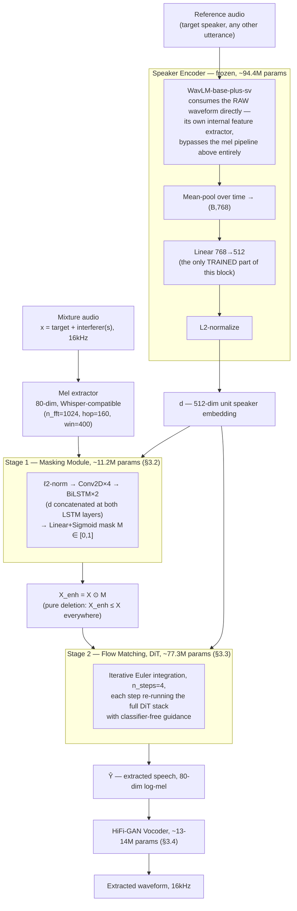
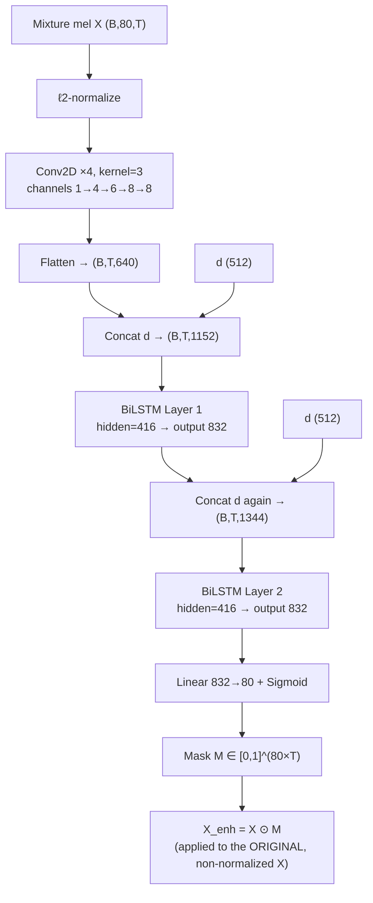
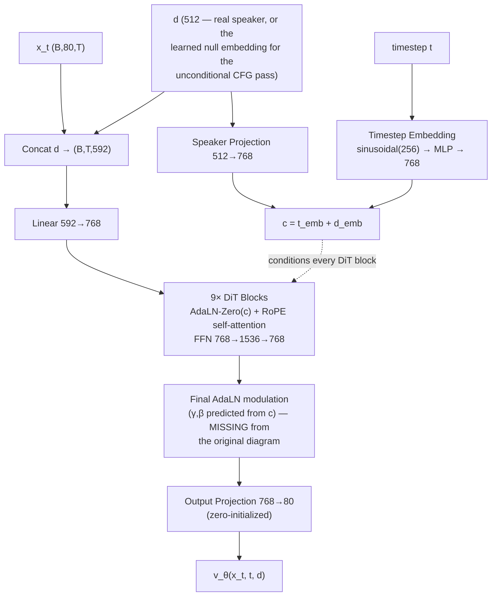
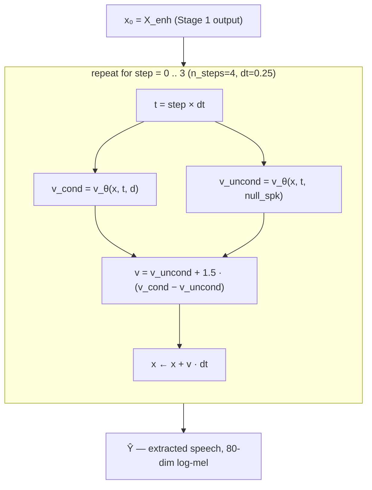
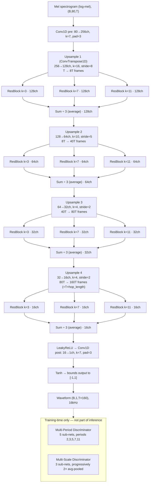

# Mask2Flow-TSE — Introduction, Related Work, Methodology, and Project Timeline

*M.Tech project. Companion document to `docs/results_and_limitations.md` (which holds the full
results tables and is the source of truth for every number) — this document covers everything that
doesn't fit there: motivation, related work, verified system architecture, and a chronological
record of the whole project so any change can be traced to what prompted it, what was tried, and
what it produced.*

---

## 1. Introduction and Motivation

### 1.1 Problem statement

Target Speaker Extraction (TSE) asks a narrower, harder question than generic speech separation:
given a mixture of overlapping speakers and a short **enrollment clip** of one target speaker,
recover *only* that speaker's voice — not "separate everyone," but "find this one person." This
matters wherever a system needs to isolate a known speaker from interference without knowing in
advance how many other speakers are present or what they sound like: hearing aids, meeting
transcription, voice-controlled devices in noisy/multi-speaker rooms, and speaker-conditioned
downstream ASR.

Two properties make this a genuinely different problem from blind source separation:
- **The target is known, everything else isn't.** The system is told "extract this voice" via a
  reference embedding, not asked to output N separated streams and figure out afterward which one
  matters.
- **The interference is unconstrained.** The number, identity, and acoustic character of
  interfering speakers can vary — a system trained only on a fixed number of competing speakers has
  no guarantee of working when that number changes, and this project's own results (§4, entries on
  the speaker-count-coverage gap) confirm this is a real, measurable failure mode, not a theoretical
  concern.

### 1.2 This project

This project implements Mask2Flow-TSE (Moon et al., arXiv:2603.12837v1) from scratch — no public
reference code exists for this paper, so every architectural and training decision documented here
was independently derived from the paper's description and validated empirically. The approach
splits extraction into two stages with different, complementary jobs:

1. **A cheap, conservative first pass (masking)** that can only *remove* energy, never add it —
   architecturally incapable of hallucinating content that wasn't in the mixture.
2. **A generative refinement pass (flow matching)** that can go beyond what masking alone can do —
   reconstructing target-speaker content the first pass under-recovered — at the cost of being a
   harder, generative problem with its own failure modes.

This two-stage decomposition, and the specific accuracy/robustness trade-offs it produces, is the
central subject of the results chapter. This project's own contribution is not the architecture
(that's the paper's) but the **from-scratch implementation, the empirical characterization of where
and why it fails, and three independently diagnosed-and-substantially-fixed limitations** — detailed
chronologically in §4.

### 1.3 What "success" means here

Three metrics, used consistently throughout this project (see `docs/results_and_limitations.md`
§5.2 for the full justification):
- **SI-SDR improvement** — the field-standard separation-quality metric, treated as primary.
- **Speaker-verification accuracy (1−EER)** — did the output actually match the target speaker's
  identity, not just improve some generic audio-quality number.
- **Mel-domain reconstruction error** — this project's own training-objective-space diagnostic,
  useful for root-causing failures but explicitly **not** used as a headline claim, since it is
  unbounded and can overstate perceptual severity in either direction.

---

## 2. Related Work

*Positioning, not a full literature review. Every citation below (including the Mask2Flow-TSE paper
itself) was verified against arXiv/publisher records on 2026-09-09 — author lists, venues, and years
all check out, with one correction applied (SpEx+ is Ge et al., not Xu et al.; Xu is a co-author).
Note for a formal reference list: several works are cited by their eventual venue year rather than
arXiv preprint year (VoiceFilter: arXiv 2018 / Interspeech 2019; WavLM: arXiv 2021 / IEEE JSTSP 2022)
— pick whichever convention the target venue's bibliography style expects.*

**Target speaker extraction.** VoiceFilter (Wang et al., Google, ~2019) established the pattern this
project's Stage 1 follows most directly: a d-vector speaker embedding conditions a spectrogram
masking network trained to suppress non-target energy. SpeakerBeam (Delcroix et al.) and its
time-domain variant TD-SpeakerBeam took a related but architecturally different approach, injecting
speaker conditioning via adaptation layers inside a time-domain separation backbone (in the lineage
of Conv-TasNet, Luo & Mesgarani). SpEx (Xu et al.) and its follow-up SpEx+ (Ge et al. — Xu is a co-author, not first author on
the + version) extended time-domain TSE with a multi-scale encoder. This project's Stage 1 (BiLSTM masking, d-vector concatenated at multiple layers) is
architecturally closest to the VoiceFilter family; its distinguishing feature versus that line of
work is that masking is *not* the final output — it is explicitly a conservative, deletion-only first
pass whose output is corrected by a second, generative stage.

**Speaker embeddings.** This project uses WavLM-base-plus-sv (Chen et al., Microsoft, ~2022) — a
self-supervised speech encoder fine-tuned for speaker verification — frozen, with a small trained
projection layer on top, following common practice of separating a large pretrained encoder from a
small task-specific head rather than training a speaker encoder from scratch.

**Generative refinement / flow matching.** Rectified flow (Liu et al.) and flow matching (Lipman et
al.) generalize diffusion-style generative training to learn a straight-line probability path
between two distributions, trainable with a simple regression loss and — critically for this
project's practical constraints — capable of good sample quality in very few integration steps,
unlike standard diffusion's typically much longer sampling chains. Voicebox (Meta) and related
flow-matching TTS/speech-editing systems demonstrate this approach applied to speech generation
broadly; this project applies the same mechanism specifically to the *correction* step of a TSE
pipeline, conditioned on Stage 1's masked output rather than pure noise. The DiT backbone (Peebles &
Xie, 2023) and classifier-free guidance (Ho & Salimans, 2022) — both originally developed in the
image-generation literature — are adopted here largely unmodified, adapted only by injecting the
speaker embedding into the AdaLN-Zero conditioning signal alongside the timestep.

**Vocoding.** HiFi-GAN (Kong et al.) is the vocoder architecture used, reconfigured for this
project's own mel spectrogram convention (80 mels, 160-sample hop, matching Whisper's format rather
than HiFi-GAN's original 256-hop TTS configuration) and trained from scratch on this project's own
data rather than reused pretrained, since no pretrained HiFi-GAN checkpoint matches this mel
configuration.

**What's genuinely novel in this project versus the above** is not any single architectural piece —
it's the *combination* (masking-then-flow-matching as two purpose-built stages with different
failure modes) as specified by the Mask2Flow-TSE paper, and this implementation's own empirical
contribution: three independently diagnosed root causes for where that combination fails (a t≈0
single-shot-prediction gap, an SNR-coverage gap, and a speaker-count-coverage gap — §4), two of which
were fixed via targeted continued training rather than architecture changes.

---

## 3. System Architecture (Methodology)

Every diagram and parameter count below was checked directly against the current code
(`models/masking.py`, `models/flow.py`, `models/speaker_encoder.py`, `vocoder_train/hifigan.py`) as
of 2026-09-05, not transcribed from the paper or an earlier design document. Diagrams are Mermaid
(rendered natively by GitHub and VS Code's Markdown preview) rather than static images, specifically
so they stay a live, editable part of the repo instead of drifting from the code silently the way the
two hand-drawn diagrams reviewed for this document had.

### 3.1 Pipeline overview

**Corrected from the original hand-drawn diagram:** the reference-audio path no longer routes through
the mixture's mel extractor — WavLM takes raw audio directly and has never used this project's mel
representation at any point.

### 3.2 Stage 1 — Masking Module

Verified exactly matching `models/masking.py`: conv channels `[1,4,6,8,8]`, LSTM hidden size 416
(→832 bidirectional), d-vector re-concatenated at *both* LSTM layers (not just the first), mask
applied to the original mel (not the ℓ2-normalized copy used only for the conv path). The mask being
strictly bounded to [0,1] is a deliberate design constraint — it makes Stage 1 capable only of
*deleting* energy, never adding it (confirmed by the project's own D/I-proportion diagnostic,
`compute_di_proportion()`, which measures a trained model at ~100% delete / ~0% insert), which is
exactly why a second, generative stage is needed for anything Stage 1 under-recovers.

**No diagram errors found here** — this part of the original diagram matched the code precisely.

### 3.3 Stage 2 — Flow Matching (DiT)

Split into two diagrams, matching how the code itself is structured: a network function
`v_θ(x_t, t, d)` (`FlowMatchingModule.forward`), and an outer iterative loop that calls it multiple
times (`FlowMatchingModule.inference`). The original diagram collapsed these into one pass, which is
correct only for the paper's minimal `n_steps=1` case — not for how this project actually runs
inference.

**3.3.1 — the network function, one call:**

**3.3.2 — inference: iterative Euler integration, n_steps=4 as actually deployed:**

Both the conditional and unconditional passes above re-run the **entire** DiT stack from §3.3.1 —
classifier-free guidance is not a cheap add-on, it roughly doubles the compute of every step. Across
4 steps, a single `inference()` call therefore runs the full 9-block DiT forward pass **8 times**
(4 steps × 2 passes each), not once.

**Corrected from the original diagram:**
1. A final AdaLN-style modulation layer (predicting γ,β from the same conditioning vector c) sits
   between the last DiT block and the output projection — the original diagram went straight from
   "9× DiT Blocks" to "Output Projection," skipping this. It's small (part of the ~1.24M-parameter
   "Output" block in the parameter breakdown) but structurally real.
2. **Inference is not single-step in this project.** The paper's equation and the code's own
   function-signature default (`n_steps=1`) describe the minimal case, but `configs/default_v2.yaml`
   sets `flow_steps: 4`, and every evaluation command used throughout this entire project
   (`eval/results_stage2.py`, `eval/full_eval.py`, `eval/eval_multi_speaker.py`, `eval/verify_eer.py`,
   ...) explicitly passes `--n_steps 4`. This is not an arbitrary choice: `n_steps=16` was tested
   directly (see §4's t≈0 investigation) and found to be *worse* at 4× the compute, so `n_steps=4`
   is the deliberately validated, currently-deployed operating point — the diagram needed to show
   the loop, not a single pass, to actually describe "the path used at inference."

### 3.4 Vocoder — HiFi-GAN

Every channel count, kernel size, and stride here reproduces `vocoder_train/hifigan.py` exactly
(`upsample_rates=(8,5,2,2)`, product 160 = this project's mel hop length by construction — this
project does **not** use HiFi-GAN's original 256-hop TTS configuration). **Corrected from the
original diagram:** each "Element-wise Sum" is actually an **average** — the code sums the three
ResBlock branch outputs, then divides by `num_kernels=3` (`xs = xs / self.num_kernels`), not a raw
sum. Discriminator configuration (5 MPD sub-nets at periods 2/3/5/7/11, 3 MSD sub-nets) matched
exactly as originally drawn.

### 3.5 Training procedure summary

- **Stage 1** trained standalone first (MSE against clean target mel), then frozen.
- **Stage 2** trained on frozen Stage 1 output — rectified-flow matching loss
  (`‖v_θ(x_t,t,d) − (Y−X_enh)‖²`, `t ~ Uniform(0,1)`, `x_t = (1−t)X_enh + tY`), with classifier-free
  guidance dropout (`cfg_dropout=0.1`) replacing `d` with a learned null embedding during training so
  the model can produce both conditional and unconditional velocity estimates at inference.
- **Vocoder** trained independently, from scratch, on this project's own data — standard HiFi-GAN
  adversarial + feature-matching + mel-L1 losses (`vocoder_train/hifigan.py`), reconfigured for this
  project's 80-mel/160-hop convention rather than reused pretrained.
- **Speaker encoder**: WavLM backbone frozen throughout; only the 768→512 projection head is
  trained (originally a real bug — see §4 — this projection was left randomly initialized and never
  optimized in early versions of the project).
- **Data**: on-the-fly mixing from LibriSpeech (`data/augment.py`'s `MixtureCreator`), one target +
  exactly one interferer per training example throughout the vast majority of this project's
  history (this constraint, and its consequences, is the subject of §4's speaker-count-coverage
  entry), SNR drawn from `[1.0, 10.0]` dB (the subject of §4's SNR-coverage entry).

---

## 4. Development Timeline

*Chronological record of the project: what was done, why, what it produced, and what followed. Full
numeric detail for every entry lives in `docs/results_and_limitations.md` (cross-referenced by
section) or the eval-tooling/scripts named — this section is the narrative thread connecting them,
not a duplicate of the tables.*

**1. Initial implementation.** Built the two-stage pipeline from the paper's description (no public
reference code existed): Stage 1 masking, Stage 2 flow matching, WavLM-based speaker conditioning,
HiFi-GAN vocoder trained from scratch for this project's own mel configuration. Trained Stage 1
(130,000 steps) and Stage 2 (298,000 steps) sequentially, then the vocoder independently.

**2. Two foundational bugs found and fixed, before any headline result could be trusted.**
- *Padding dilution*: the fixed `segment_length=10s` training window zero-pads every shorter
  utterance (test-clean averages only 7.4s), and that padding was never masked out of loss or eval
  computation — inflating every MSE-based "improvement %" reported project-wide. Fixed by threading
  `target_valid_frames` through the data pipeline, loss functions, and eval scripts, so padding is
  excluded everywhere.
- *Unseeded speaker-projection*: the WavLM→512-dim projection layer was never included in any
  optimizer, so it was random on every script invocation. Fixed by actually training it
  (`training/train_speaker_encoder.py`) and requiring `--projection_ckpt` everywhere the encoder is
  built.

Both fixes were necessary before any of the results below could be considered meaningful — see
`docs/results_and_limitations.md` §5.1 note and the `mask2flow-tse-fixed-bugs` project record.

**3. First honest baseline established.** Full two-stage pipeline, seed=42, real LibriSpeech
test-clean: median mel improvement 75.8% (full pipeline), 71.9% (Stage 2 over Stage 1 alone), but
speaker-similarity checks showed net-positive median improvement with 30% of samples having
extraction *reduce* similarity versus doing nothing — the first sign of a non-uniform failure mode,
not yet root-caused.

**4. Catastrophic-outlier investigation.** ~12% of samples showed Stage 2 making mel-MSE dramatically
*worse* than Stage 1 alone (regressions to −2454%). Three plausible inference-time mechanisms were
tested and ruled out in turn: speaker-embedding degeneracy (verification AUC 0.93–0.97 — the
embeddings were fine), CFG amplification at t≈0 (a `cfg_warmup_steps` fix only helped 1 of 8 flagged
samples), and coarse Euler discretization (`n_steps=16` was tested directly and was *worse* than
`n_steps=4` at 4× the compute — this is why §3.3.2 above documents `n_steps=4`, not a higher count,
as the deployed configuration). **Root cause found**: at t=0 the rectified-flow interpolation gives
zero progress signal (`x_t = x_enh` exactly), so the model must predict the entire correction in one
shot; cosine similarity between the model's raw t=0 prediction and the true required velocity was
0.77–0.92 for healthy samples but only 0.08–0.15 for the worst offenders — a genuine training-coverage
gap, not a numerical or guidance defect. Initially closed as a *characterized but unfixed* limitation
given the time/compute cost of the obvious fix (continued training).

**5. The t≈0 gap was fixed.** Reopened later: continued Stage 2 training for 25,000 steps with t≈0
hard-example reweighting (`training/finetune_flow_hard_t0.py`). Validated on the real target metric
(corpus-wide speaker-verification EER, not the training-time proxy, which got *worse* as expected
since it was now scoring a harder oversampled distribution) and on the full n=2620 set: catastrophic
rate 12.7%→3.5% (3.6× reduction), median mel S2-vs-S1 67.3%→77.7%, median SI-SDR gain +0.93→+1.58dB,
holding across every SNR bucket. Promoted to `checkpoints_v2/flow/flow_best.pt`. Full detail:
`docs/results_and_limitations.md` §5.3.

**6. Cross-corpus generalization confirmed — and a second gap discovered.** Ran the fixed checkpoint
against Libri2Mix, a benchmark built independently of this project's own mixer. The raw aggregate
looked poor (median mel 23.9%, catastrophic 26.7%) until traced to a real distribution-mismatch, not
a generalization failure: Libri2Mix's `mix_clean` has no SNR floor, while this project's mixer never
trains below `snr_min=1.0`. Restricted to the trained SNR range, results (73.4% median, 5.7%
catastrophic) matched the in-domain headline — confirming the t≈0 fix generalizes — while also
surfacing a **second, distinct, well-characterized limitation**: zero training coverage below 1dB
SNR, a separate mechanism from t≈0 (an SNR-coverage gap, not a single-shot-prediction gap). Left as
characterized-but-unaddressed future work given the scope at the time. Full detail: §5.4/§5.5.2.

**7. Multi-speaker generalization tested — a third gap found.** Asked directly: what happens with a
genuine 3rd or 4th simultaneous talker, when training only ever used exactly one interferer? Built
`eval/eval_multi_speaker.py` and a proper corpus-wide accuracy metric (reusing the same
genuine/impostor methodology as the trusted 2-speaker headline). Result: real degradation as speaker
count rose (2-speaker 86.3%→3-speaker 76.7%→4-speaker 72.6% accuracy), but *graceful*, not
catastrophic — and one specific number needed a careful read: SI-SDR gain appeared to *improve* with
more speakers, which traced not to the model doing better but to the baseline collapsing faster
(more competing voices leaves less signal in the raw mixture to begin with).

**8. Cheap fix ruled out; the failure was isolated to one stage.** A `cfg_scale`/`n_steps` sweep at
the 4-speaker condition found no real effect (all variants within ~1pp of each other) — matching the
precedent from the t≈0 investigation that inference-time knobs don't fix training-distribution gaps.
Breaking the existing records down by stage (no new evaluation needed) showed Stage 1 completely
unaffected by speaker count (if anything marginally better at 4 speakers) — the entire degradation
was in Stage 2. This scoped the fix to Stage-2-only, before any training code was written.

**9. The speaker-count gap was fixed the same way the t≈0 gap was.** Extended
`LibriSpeechTSEDataset` to sample a variable interferer count (opt-in, zero effect on any existing
caller by default), fine-tuned Stage 2 only for 25,000 steps with a curriculum weighted toward the
original 2-speaker condition (50%/30%/20% across 2/3/4 speakers, specifically to avoid regressing
the already-validated 2-speaker numbers). Compared two candidate checkpoints on the real metric (not
the training proxy, which — as with t≈0 — plateaued early and was not trusted on its own), promoted
the stronger one. Result: 4-speaker accuracy 72.6%→76.7% (clearing the 75–80% target), 2-speaker
accuracy held (86.3%→86.7%), on a full n=2620 re-validation SI-SDR (the primary metric) improved
slightly (+1.58→+1.71dB) alongside a small, consistently-explained softening in the mel-domain
diagnostic. Full detail and the six-point causal analysis of *why* each number moved the way it did:
`docs/results_and_limitations.md` §5.7.

**10. Full headline refreshed against the new checkpoint.** The corpus-wide EER check and the
Libri2Mix cross-corpus check had been measuring the *previous* checkpoint; re-run against the new
one. Every trustworthy metric — accuracy and SI-SDR, on every corpus and every speaker count tested
— held or improved; only the (explicitly secondary) mel-domain diagnostic softened slightly, by a
consistent small margin, in both the in-domain and cross-corpus tables — the same known artifact of
that metric, not a real quality regression. Libri2Mix's out-of-distribution slice (the untouched
SNR-coverage gap from step 6) stayed exactly flat, which is itself useful evidence the improvement
was targeted rather than a fluke.

**11. A real measurement bug found via manual listening, not any metric.** User-reported listening
observations — occasional "metallic" vocoder quality, and speaker-similarity scores that seemed low
despite a subjectively correct voice — led to checking whether `trim_trailing_silence()` (an existing
fix from item 2's padding-dilution bug) was actually applied to reference clips in every accuracy
script. It wasn't, in three of them. Fixed in `eval/eval_multi_speaker.py`; the same gap remains open
in `eval/verify_eer.py` / `eval/eval_libri2mix.py` (low priority — the direction of the bug means
every reported accuracy number is a lower bound, not inflated).

**12. Qualitative verification.** Built `eval/export_listening_samples.py` to export real, playable
`.wav` files (mixture / reference / extracted / ground-truth-clean / Stage-1-only) across 2/3/4-speaker
mixtures, specifically designed so the vocoder-artifact question could be answered by ear (compare
`extracted.wav` against `target_clean.wav`, which shares the identical vocoder but real, not
predicted, mel input). Manually confirmed correct across the sampled sets — consistent with the
quantitative numbers. Decision made to leave the checkpoint as-is rather than pursue the
metallic-vocoder question further, given the confirmed-correct outcome. Full detail:
`docs/results_and_limitations.md` §5.8.

**13. Architecture diagrams audited against code (this document).** Two hand-drawn architecture
diagrams were checked line-by-line against `models/masking.py`, `models/flow.py`,
`models/speaker_encoder.py`, and `vocoder_train/hifigan.py`. Found and corrected: the reference-audio
path incorrectly routing through the mel extractor before the speaker encoder (WavLM takes raw audio
directly), inference drawn as a single Euler step when this project's deployed configuration runs
four, a missing final AdaLN modulation layer before the output projection, and the vocoder's
"element-wise sum" actually being a division-by-3 average. Diagrams rebuilt as Mermaid (§3) so they
stay checked into the repo as text rather than static images that can silently drift from the code.

**14. Reference-clip trailing-silence fix completed, and the SNR gap scoped by stage (2026-09-09/10).**
The `trim_trailing_silence()` gap left open in item 11 was closed in the remaining two scripts
(`eval/verify_eer.py`, `eval/eval_libri2mix.py`) and both were rerun. Result: no material change
(accuracy 87.0%→86.5%, Libri2Mix in-distribution mel and SI-SDR identical to the decimal) — the
previously-flagged "lower bound" caveat turned out to be theoretically correct but empirically
negligible, since only a minority of enrollment clips are short enough for padding dilution to
matter (§5.9). Attention then turned to the one limitation still open — the SNR-coverage gap — and
the same zero-cost stage-attribution trick used in item 8 was applied to the existing Libri2Mix
records, splitting `mel_s1_imp_pct` / `mel_s2_vs_s1_pct` by `snr_db`. **The result differs
importantly from the speaker-count case.** There, Stage 1 was untouched and all degradation sat in
Stage 2, which cleanly justified a Stage-2-only fix. Here, Stage 2 is again the dominant failure —
below −5dB it makes 94.8% of samples *worse* than Stage 1, essentially a total breakdown rather than
an outlier tail — but Stage 1 also degrades this time (median mel improvement decaying 8.1%→1.1%,
its "hurts" rate rising 2.6%→20.3%). Most notably, Stage 1's two metrics disagree in *direction* at
low SNR: mildly positive in mel terms (+1.1%) while severely negative in SI-SDR terms (−7.83dB),
because a deletion-only mask forced to remove most of the spectrum takes target energy with it —
damage that log-mel MSE forgives and SI-SDR does not. This is a sharper caveat than §5.2's existing
framing (there, mel understates severity; here it inverts the sign) and it means Stage 1 is a
plausible ceiling on any Stage-2-only fix, unlike last time — so the plan is to start Stage-2-only
(where 94.8% of the damage is, and following the two prior successful fine-tunes) while treating a
plateau well short of target as the signal that Stage 1 needs retraining too, rather than a surprise.

**15. Low-SNR curriculum built (2026-09-10, results pending).** Implementation of the fix scoped in
entry 14, following the same opt-in discipline as the multi-speaker work so that no existing caller
changes behavior. `MixtureCreator.create_mixture()` gained an optional `snr_db` override (default
`None` = sample internally, exactly as before); `LibriSpeechTSEDataset` gained `low_snr_prob` /
`low_snr_range` (default off), applied to *both* the single- and multi-interferer paths so a combined
curriculum stays coherent; `build_dataloaders_multispeaker()` passes them through to the TRAIN split
only. Two deliberate choices worth recording. First, **the speaker-count curriculum stays active
during this fine-tune**: the checkpoint being fine-tuned *is* the hard-multispeaker result, so
training it on single-interferer mixtures alone would risk handing back the 3-/4-speaker gains — both
curricula therefore run together. Second, **validation deliberately stays 2-speaker at the original
[1,10]dB**, so `val_loss` remains comparable to every prior run; as in both earlier fine-tunes it is
expected to look *worse* while the real metric improves, and the judgement metric is
`eval_libri2mix.py`'s SNR-split table instead. `training/finetune_flow_hard_lowsnr.py` deliberately
does not duplicate the 330-line training loop — that loop is curriculum-agnostic (it consumes
whatever the dataloaders yield) and already proven over a completed 25k-step run, so the new script
reuses it and only overrides the checkpoint directory. A pre-flight smoke test
(`scripts/smoke_test_lowsnr_curriculum.py`) verifies the default path is untouched — including that
it consumes no extra RNG draws, which would otherwise silently shift every seeded run — before any
GPU time is spent. One implementation bug was caught during review and fixed: the SNR-draw helpers
were initially inserted mid-constructor, orphaning the speaker-index setup after a `return`.

**16. Low-SNR fine-tune run and evaluated — the gap closes, but at a real cost (2026-09-10).**
The 50/50 curriculum trained cleanly (job 10991, 25,000 steps, 12.98h). Evaluation (job 11032) added
one test the earlier characterization lacked: because Libri2Mix confounds *low SNR* with *a different
corpus and mixer*, `eval_multi_speaker.py`'s `--snr_min`/`--snr_max` flags were used to run the same
corpus, mixer, speakers and seed at [−10,1)dB against both checkpoints, isolating the SNR variable.
That controlled test is the clearest result in this project: the pre-fine-tune checkpoint scores
**61.3% speaker accuracy at low SNR against a 64.0% do-nothing mixture baseline** — extraction was
*actively harmful*, worse than not running the system at all — while the fine-tune reaches 71.3%.
Median mel goes −45.1% → +50.1% and SI-SDR vs Stage 1 −5.94dB → +4.11dB. Libri2Mix agrees on its
out-of-distribution slice (mel −19.0% → +8.5%, catastrophic 40.4% → 29.2%, SI-SDR vs Stage 1
−1.50dB → +1.42dB), and its raw aggregate — the figure a reader meets first, without any SNR caveat —
turns positive for the first time (SI-SDR vs mixture −0.04dB → +1.09dB).

**The cost is equally clear, and unlike the two earlier fine-tunes it is not confined to the
mel diagnostic.** Corpus-wide accuracy falls 86.5% → 82.0%; in-domain n=2620 catastrophic rate rises
3.7% → 15.5% (4.2×); SI-SDR vs Stage 1 falls +1.71dB → +1.16dB; the 2-/3-/4-speaker accuracies fall
86.7/81.9/76.7 → 81.4/77.3/73.3. Per-bucket rates show this is genuine capacity reallocation rather
than noise: catastrophic rate below 0dB improves 45.0% → 31.9% while [5,7)dB degrades 0.8% → 4.7% —
the model traded easy-case precision for hard-case competence. **The checkpoint was therefore NOT
promoted**: it would invalidate §5.7's "every trustworthy metric held or improved" claim, and a 4×
in-domain catastrophic-rate increase is too steep for a default checkpoint. This is the first
fine-tune in the project to be rejected on its measured results, and recording *why* matters as much
as the two that were accepted.

**Open question it raises, and the follow-up:** is that trade inherent to covering both regimes with
one model, or merely an over-aggressive 50% curriculum? A second point on the curve
(`scripts/run_finetune_flow_lowsnr25_gpu.sh`, 25% low-SNR weight, started from the *same*
`flow_best.pt` so curriculum strength is the only variable) answers it directly, turning a binary
promote/reject into a proper trade-off study. Supporting tooling was generalized at the same time:
`scripts/run_eval_candidate_gpu.sh` runs the full promotion battery against any candidate, and the
SNR-split computation behind every table in §5.5.2 — previously an ad-hoc snippet — became
`eval/snr_split_summary.py`.

**17. 25% curriculum trained; promotion criteria fixed before evaluation (2026-09-11).** The gentler
run completed cleanly (job 11033, 25,000 steps, 13.84h), with the log confirming 25% of examples
from [−10,1)dB, 75% from the trained [1,10]dB, the speaker-count curriculum still active, and a fresh
start from the same `flow_best.pt` as the 50% run. Because this run exists to locate a point on a
trade-off curve, the decision rule was written down **before** any evaluation result was seen, so the
outcome can't be rationalised after the fact. Thresholds are set by each metric's sampling noise, not
picked for convenience (binomial SE ≈ 1.7pp for accuracy at n=400, ≈ 0.4pp for catastrophic rate at
n=2620, ≈ 2.5pp for accuracy at n=300):

| Bar | Metric | Reference | Requirement |
|---|---|---|---|
| Primary: the defect is fixed | In-domain low-SNR accuracy (n=300) | Do-nothing mixture 64.0%; old ckpt 61.3% | ≥ ~67%, clearly above the do-nothing line |
| Retention | Corpus-wide accuracy (n=400) | 86.5% | ≥ 85% |
| Retention | In-domain n=2620 catastrophic rate | 3.7% | ≤ 5% |
| Retention | 2/3/4-speaker accuracy (n=300) | 86.7 / 81.9 / 76.7% | each within ~3pp |

Three outcomes, each with a pre-committed response: **(a)** primary bar and all retention bars met →
promote, after the standard backup-and-MD5 procedure. **(b)** Lands between the two earlier points on
both axes without meeting retention → the trade is inherent to covering both regimes with one
model; stop tuning curriculum weight, keep `flow_best.pt`, and document the measured curve as the
result. **(c)** Costs mostly vanish but the primary bar isn't cleared → curriculum weight isn't the
lever at all, and entry 14's Stage-1-ceiling hypothesis becomes the leading explanation for why a
Stage-2-only fix can't get there.

**18. 25% run evaluated: outcome (b), and Stage 1 identified as the bottleneck (2026-09-11).** The
entry-17 rule was applied exactly as written (job 11054):

| | Pre-fine-tune (`flow_best.pt`) | 25% curriculum | 50% curriculum |
|---|---|---|---|
| Low-SNR in-domain accuracy (primary, ≥ ~67%) | 61.3% | **68.9% — met** | 71.3% |
| Corpus-wide accuracy (≥ 85%) | 86.5% | **83.7% — failed** | 82.0% |
| In-domain catastrophic rate (≤ 5%) | 3.7% | **11.3% — failed** | 15.5% |
| In-domain SI-SDR gain vs Stage 1 | +1.71 dB | +1.31 dB | +1.16 dB |
| In-domain severe regressions (SI-SDR < −10 dB vs Stage 1) | 2.0% | 7.5% | 10.2% |
| 2/3/4-speaker accuracy (each within ~3pp) | 86.7 / 81.9 / 76.7% | 84.7 / 79.0 / 75.3% — met | 81.4 / 77.3 / 73.3% |
| Libri2Mix SNR<1dB median mel / catastrophic | −19.0% / 40.4% | −8.5% / 34.6% | +8.5% / 29.2% |

Every metric lies between the two earlier points: outcome (b). The pre-committed response was
followed — `flow_best.pt` kept, curriculum-weight tuning stopped. The curve has no knee: the 25% run
retains 38–76% of the 50% run's gains (76% on controlled low-SNR accuracy, only 38% on Libri2Mix
out-of-distribution mel) while retaining 62–73% of its in-domain costs, so there is no weight at
which the cost falls away faster than the benefit. Because the catastrophic-rate bar is mel-based and
§5.2 treats mel as diagnostic, the verdict was cross-checked on SI-SDR: severe regressions rise 2.0%
→ 7.5% → 10.2%, and the share of mel-catastrophic cases whose audio is roughly unharmed (SI-SDR within
3 dB of Stage 1) *falls* from 47% for the pre-fine-tune checkpoint to ~25% for both fine-tunes. The
fine-tunes' mel failures are therefore mostly real damage, and the mel rate understates their cost
rather than inflating it.

**Why the trade is inherent.** Entry 14 raised Stage 1 as a possible ceiling, and the existing
Libri2Mix records allow a direct test: Stage 1 is frozen, so its output is identical across checkpoint
files (verified to four decimal places). Holding SNR fixed within narrow bands, samples were split
into quartiles by how much Stage 1 degraded SI-SDR relative to the mixture. In the [−5,−2) dB band the
50% checkpoint's net result against doing nothing is −15.3 / −14.0 / −7.7 / +3.9 dB from most- to
least-damaged quartile, and the system beats doing nothing in 26 / 22 / 32 / 64% of samples; the
[−2,0) dB band shows the same pattern (−6.3 / −5.2 / +0.7 / +6.3 dB; 33 / 34 / 54 / 84%). Stage 2 is
not passive — its gain over Stage 1 is largest precisely where Stage 1 did the most harm (+7.0 and
+11.6 dB in the worst quartiles) — but it recovers only part of the target energy the deletion-only
mask removed, so final quality is set largely by Stage 1. That supplies a mechanism for the
proportional trade: capacity Stage 2 spends reconstructing deleted energy at low SNR is capacity
withdrawn from high-SNR precision. The analysis is correlational, though — intrinsically difficult
mixtures (similar voices, say) could defeat both stages independently — so the proposed next step is
a causal test: give Stage 2 an oracle deletion-only mask at low SNR and measure whether it then
succeeds. It is evaluation-only, and its design depends on how the mask interacts with the log-mel
representation, which has to be checked first.

**A measurement confound, found and scoped.** The 2/3/4-speaker baselines (job 10890) were written on
2026-09-04 at 10:17–10:24, before the `trim_trailing_silence()` fix reached `eval_multi_speaker.py`
(made while building the listening-samples exporter, job 10902, 13:56 that day); every candidate was
measured with the fix. A 2026-09-09 comment in `scripts/rerun_verify_eer_and_libri2mix_gpu.sh` stated
the opposite; it was wrong and has been corrected. The verdict is unaffected: both failed bars are
like-for-like comparisons (the corpus-wide accuracy baseline was re-measured with the fix on
2026-09-09, and the in-domain evaluation uses the same script, with dataset changes that are opt-in
and leave the default path unchanged), and the fix moved every other metric by ≤ 0.5pp. Re-running
the current checkpoint on the three speaker-count conditions (~15 min) would make the baseline column
fully like-for-like.

**19. Stage 1's mask formulation found to structurally limit low-SNR extraction; oracle experiment
built (2026-09-11).** Designing the causal test proposed in entry 18 required checking exactly how
Stage 1 applies its mask, and that check turned up a structural property rather than an experimental
detail. `data/mel.py` computes `log(mel + 1e-8)`, so every time-frequency bin with linear power below
1 is negative (silence sits near −18.4), and `models/masking.py` applies the mask by multiplying those
log values: `x_enhanced = x_mel * mask`, with the mask in [0, 1]. A product X·M always lies between X
and 0. A loud (positive) bin can therefore be pulled down only as far as 0 — linear power 1, never
below — and a quiet (negative) bin can only be left unchanged or made *louder*. The module's own
docstring claim that X_enh ≤ X everywhere ("pure deletion") holds only for non-negative values. At low
SNR, where the task is precisely to strip a louder interferer off a quieter target, this is the
operation the formulation cannot perform in negative bins.

This is not an implementation error, and it was checked against the paper directly. The paper
specifies the same formulation — Eq. 9, X_enh = X ⊙ M on log-mel with a sigmoid mask; Eq. 11,
the reconstruction loss; Table 3, reporting D = 100% and I = 0%; Eq. 12, Stage 2 starting from X_enh —
but never states the log offset, base, or dB scaling. "Pure deletion" is only guaranteed when log-mel
values are non-negative (for example `log(1 + mel)`); this implementation's tiny offset makes quiet
bins negative. The accurate description is an under-specified detail in the paper interacting with a
reasonable implementation choice — worth stating precisely, since it is easy to misdescribe as either
a bug or a flaw in the paper.

It also sharpens what entry 18's correlational result could mean. Stage 1's damage at low SNR may be a
ceiling of the *formulation* rather than of the *trained network*, and the two have opposite remedies:
retraining a network cannot move a ceiling imposed by its formulation. The experiment was redesigned to
separate them. `eval/eval_multi_speaker.py` gained `--stage1_mode`, defaulting to the trained network
(behavior unchanged), plus two diagnostic oracles built from the clean target and therefore unusable at
inference. `oracle_logmask` is the best mask that exists *within* the paper's formulation — per bin,
the M in [0, 1] minimizing the Stage 1 loss, `clip(Y/X, 0, 1)`. `oracle_energy` is genuine energy
deletion: an ideal ratio mask on linear power, which in log space reduces exactly to `min(X, Y)`; it is
close to the clean target, so it bounds what a change of formulation could buy rather than modelling a
real system. If `oracle_logmask` barely improves on the network, retraining Stage 1 cannot close the
gap; if it improves substantially, the network is the bottleneck; the distance between the two oracles
prices a change of formulation. Every record, in every mode, also carries per-sample measurements of
the formulation's reach — the share of negative mixture bins, the share of target bins no [0, 1] mask
can reach, and how often the trained network actually raises bins (its insert proportion) — which tests
the paper's D = 100% claim directly on this implementation. The runs
(`scripts/run_eval_stage1_oracle_gpu.sh`) cover both oracles against both the pre-fine-tune and 50%
checkpoints at low SNR, the same oracles at the trained SNR range as a control, and fresh 2/3/4-speaker
baselines for the current checkpoint, which close the trim-fix confound from entry 18. Because the full pipeline only runs on the cluster, the two
new helpers were verified locally before any GPU time was spent, by extracting them from the module
and checking them against hand-derived cases (`test_stage1_oracle.py`, 13 checks). Among them: the
log-domain oracle cannot push a −10 bin down to a −15 target while the energy oracle reaches it
exactly, and the log-domain oracle is the best possible [0, 1] mask in every one of 4,000 random bins
when compared against a 201-point grid of masks.

**20. Oracle decomposition: low-SNR failure is part learnable, part structural (2026-09-11).** All
nine runs completed (job 11075). Pairing each oracle run with the earlier network runs confirmed the
comparison is exact: identical sample IDs gave bit-identical mixture error and identical frozen-Stage-1
error (maximum difference 0.0 across 300 samples in every pairing).

At low SNR with the current checkpoint:

| Stage 2's input | Speaker accuracy | Final SI-SDR vs mixture | System beats doing nothing |
|---|---|---|---|
| Trained Stage 1 | 61.3% | −15.86 dB | 25% of samples |
| Best mask within the paper's formulation (`oracle_logmask`) | 73.0% | +7.98 dB | 74% |
| True energy deletion (`oracle_energy`) | 89.9% | +20.21 dB | 100% |
| Ground-truth ceiling | 90.3% | | |

Paired on identical samples, the best in-formulation mask improves final SI-SDR over the trained
network by a median 16.2 dB (better in 89% of samples), and true deletion improves on that by a further
11.1 dB (better in all 300). The answer to entry 18's causal question is therefore *both*. The trained
network sits far below what its own formulation permits — Stage 1 alone scores −5.8 dB against the
mixture where the best in-formulation mask scores +8.3 dB — and the formulation itself sits far below
true deletion. The two gaps are of comparable size, and which is larger depends on the metric (11.7 vs
16.9 accuracy points, but 16.2 vs 11.1 dB of SI-SDR), so neither should be described as dominant. The
trained-SNR control places them: the same gaps shrink to 1.4 and 1.3 accuracy points there (still +2.0
and +7.5 dB of SI-SDR, a metric not squeezed against a ceiling), so both limits bite hardest precisely at
low SNR.

The formulation measurements explain why. 74% of low-SNR mixture bins are negative, and 73.5% of
target bins cannot be reached by any mask in [0, 1] — a figure still at 66.7% in the trained SNR range.
That follows directly: a negative bin is reachable only if the target is at least as loud as the
mixture there, and additive interference makes the target quieter almost everywhere. At high SNR the
per-bin shortfall is small and costs little; at low SNR it is large. The unreachable bins are
overwhelmingly quiet ones, which is also why log-mel MSE misleads here: the best in-formulation mask
improves Stage 1's mel error by only 17%, yet final SI-SDR by 16 dB, because the leftover log-domain error
sits in low-energy bins that dominate the MSE while carrying little of the signal. The paper's I ≈ 0%
claim survives on its own terms — the trained network's insert proportion is 0.1–0.3% — but only because
that measure is magnitude-weighted: the network actually raises about one bin in seven, each by a
small amount.

Two further results shape the next step. Stage 2 behaves well on near-perfect input (from
`oracle_energy` it changes SI-SDR by just +0.03 dB and reaches the ground-truth ceiling), so it would
not undermine a better Stage 1. And the 50%-curriculum Stage 2 gains far less from a better mask than
the pre-fine-tune one (+4.5 dB versus +16.2 dB, paired), consistent with it having learned to compensate
for Stage 1's errors; any improved Stage 1 should be paired with the pre-fine-tune `flow_best.pt`.
Finally, the confound from entry 18 is closed. Re-measured with the trimming fix, the current checkpoint
scores 87.3 / 82.1 / 77.0% at 2 / 3 / 4 speakers (previously 86.7 / 81.9 / 76.7%), and these replace the old
figures as the like-for-like baseline. Against them the 25% run's 3-speaker drop is 3.1 points, just past
the ~3-point bar and within sampling noise; entry 18's verdict stands, since it rested on two
unambiguous failures.

**21. An A/B of the two mask formulations built, with its decision rule fixed in advance
(2026-09-11).** Entry 20 showed that both Stage 1's trained network and its formulation limit low-SNR
extraction, but oracles only give ceilings; only real trained networks show what is achievable. The
test chosen trains Stage 1 twice under identical conditions, differing solely in how the mask is
applied, and evaluates both with the unchanged `flow_best.pt` as Stage 2.

The formulation became a property of the model rather than a separate code path. `MaskingModule`
gained `mask_mode`: `multiplicative`, the default and the paper's Eq. 9 (X · M), and `log_gain`
(X + log M). The latter is the same mask scaling linear power, so it can only ever lower a bin: true
deletion, which is what the paper's D = 100% analysis describes. The two modes share every parameter
and differ only in that final step, so existing checkpoints load into either, and both arms warm-start
from the same `mask_best.pt`. The log-gain is computed as `logsigmoid` of the logits rather than
`log(sigmoid(...))`, which underflows to −∞ for large negative logits. The module's docstring, which
asserted "X_enh ≤ X everywhere → pure deletion" unconditionally, was corrected to state where that
holds and where it does not.

Because the mode is not a parameter, it has to travel with the checkpoint. `save_checkpoint` now
accepts optional extra fields (when omitted, the payload is exactly as before), and all three Stage-1
loaders — `load_masking`, used by every evaluation and by inference; `load_frozen_masking`, used in
Stage-2 training; and the older results script's loader — restore the mode from the checkpoint,
treating checkpoints written before this change as multiplicative. No evaluation or training script
needed a new flag, and nothing existing changes behavior.

`training/finetune_mask_lowsnr.py` runs one arm (`--mask_mode multiplicative | log_gain`) with
everything else held equal: the same warm start; the same 50% low-SNR curriculum with the 2/3/4-speaker
mix; 25,000 steps; the same seed, so both arms construct identically and see the same data order; and
a learning rate of 1e-4. That rate sits deliberately between the Stage-2 fine-tunes' 4e-5 and Stage 1's
original 2e-4: the log-gain arm has to re-learn gain magnitudes, and a rate tuned for gentle nudging
would handicap it, while a fair comparison needs both arms to share it.
`scripts/run_eval_candidate_gpu.sh` gained an optional Stage-1 checkpoint argument, and its reference
numbers were updated to the like-for-like baseline. Before any GPU time, `test_mask_formulation.py`
(14 checks) confirmed locally that the default mode is unchanged; that the same weights load strictly
into the log-gain mode and it never raises any bin; that logits of −200 still give finite outputs and
live gradients; and that the mode survives a save-and-load round trip through both production loaders
while old checkpoints still load as multiplicative. Every changed file also passed a syntax and
undefined-name check.

**Decision rule, fixed before any result exists.** An arm is promotable only if it clears the same
bars used for the Stage-2 runs (entry 17), against the like-for-like baseline: low-SNR in-domain
accuracy of at least ~67%, clearly above the 64.0% do-nothing line (currently 61.3%); corpus-wide
accuracy ≥ 85% (86.5%); in-domain catastrophic rate ≤ 5% (3.7%); and 2/3/4-speaker accuracy each within
~3 points of 87.3 / 82.1 / 77.0%. If both arms qualify, `log_gain` is preferred only if its low-SNR
accuracy exceeds the multiplicative arm's by more than ~3.5 points — roughly the noise in a difference
of two n = 300 accuracies — and otherwise the paper-faithful multiplicative arm is chosen, because
departing from the paper's formulation has to be earned by a measured gain rather than a ceiling. If
neither qualifies, the learnable gap proved not closable by Stage-1 fine-tuning at this budget, and
that is recorded as the result.

**22. The A/B resolved: the paper's formulation wins, and the win comes from Stage 1 (2026-09-12).**
Both arms trained 25,000 steps from the same warm start under the same curriculum (jobs 11076 and
11077, 7.7h and 8.5h) and were evaluated with the unchanged `flow_best.pt` as Stage 2 (jobs 11081 and
11082). Entry 21's pre-registered rule applied as written:

| Bar | Baseline | Multiplicative arm | log_gain arm |
|---|---|---|---|
| Low-SNR in-domain accuracy (≥ ~67%) | 61.3% | **69.7% — met** | 69.4% — met |
| Corpus-wide accuracy (≥ 85%) | 86.5% | **86.5% — met** | 76.5% — failed |
| In-domain catastrophic rate (≤ 5%) | 3.7% | **4.6% — met** | 97.7% — failed |
| 2/3/4-speaker accuracy (within ~3pp) | 87.3 / 82.1 / 77.0% | **84.9 / 80.0 / 75.4 — met** | 76.6 / 69.3 / 66.0 — failed |

Only the multiplicative arm qualifies, so the tie-break never applies and the paper's formulation is
retained.

**What the multiplicative arm bought.** Low-SNR in-domain accuracy rises 61.3% → 69.7%, and the
system's SI-SDR against doing nothing goes −15.86 dB → +1.08 dB, while corpus-wide accuracy is
unchanged at 86.5%. On Libri2Mix the aggregate turns positive for the first time (SI-SDR against the
mixture −0.04 → +1.91 dB; median mel 32.3% → 54.3%; catastrophic 26.6% → 19.1%), the
out-of-distribution slice improves from −19.0% to +11.2% median mel with catastrophic 40.4% → 28.2%,
and the in-distribution slice improves as well (catastrophic 5.3% → 4.9%, SI-SDR over Stage 1
+2.51 → +2.75 dB). The costs are small: in-domain catastrophic 3.7% → 4.6%, SI-SDR over Stage 1
+1.71 → +1.54 dB, and about two points of speaker-count accuracy.

The comparison with entry 18's Stage-2 attempts is the useful part. Fine-tuning **Stage 1** reaches
essentially the same low-SNR accuracy as the 50% **Stage-2** curriculum (69.7% versus 71.3%) while
giving back almost none of the cost: corpus-wide accuracy 86.5% versus 82.0%, in-domain catastrophic
4.6% versus 15.5%. Entry 18's conclusion that the trade was inherent therefore held only for
Stage-2 fine-tuning; moved to the stage the oracle identified, the same capability is close to free.
Even in the winning arm Stage 2 now subtracts from Stage 1 at low SNR (−1.40 dB, median mel −6.3%),
because Stage 1 moved and Stage 2 did not — a light Stage-2 adaptation to the new Stage 1 is the
obvious next step.

**Why log_gain failed, and what it showed.** Its Stage 1 is by far the most accurate measured in this
project — median masked mel error 2.296 at the trained condition against 5.939 for the multiplicative
arm and 5.944 for the original, and 3.809 at low SNR against 11.180 and 13.151 — and it deletes in
100.0% of bins, exactly as designed. The frozen Stage 2 then destroys it, worsening its input in
97.7–98.7% of samples in every condition, in-distribution included. That is the risk named in entry 21
landing exactly as described: Stage 2 was trained on multiplicative Stage-1 outputs, which can never
fall below the mixture in a negative bin, so log-gain output is out of distribution for it. The result
converts entry 20's formulation gap from a ceiling into a measured cost of adoption — the change is
achievable at Stage 1, but cannot be adopted without retraining Stage 2, which this two-stage design
makes expensive.

One further observation for the thesis: the multiplicative arm now raises 18–23% of bins, up from
13–16%, with its insert proportion rising from 0.1–0.3% to 0.4–0.8%, continuing the drift seen during
training (deletion share 99.8% → 87.3%). Fitting low-SNR targets pushes the paper's formulation
further into exactly the insertion its own D/I analysis reports as absent.

**23. Stage 1 promoted; Stage 2 adaptation queued (2026-09-12).** `mask_ft_multiplicative_final.pt`
was copied over `checkpoints_v2/masking/mask_best.pt` by the same procedure as the flow promotions — a
plain file copy through the mount, with the previous checkpoint backed up to
`mask_best_prelowsnr_backup.pt` first and both copies MD5-verified (backup `c346d823…`, matching the
file it replaced; promoted `7db6352d…`, matching its source). This is the project's first Stage-1
promotion: Stage 1 had been frozen since 2026-08-02, and every result from §5.1 onward was measured
against it. The current system is therefore the promoted Stage 1 with the unchanged `flow_best.pt`,
and its numbers are job 11081's throughout. Earlier baseline JSONLs and the candidate evaluator's
reference header describe the pre-promotion system, and the header was updated so future candidates
are not judged against a system that no longer exists.

Because Stage 1 moved and Stage 2 did not, the pipeline is now mismatched at low SNR, where Stage 2
subtracts 1.40 dB from Stage 1's output. `scripts/run_finetune_flow_adapt_newmask_gpu.sh` fine-tunes
Stage 2 on the new Stage 1's outputs, deliberately using the curriculum Stage 1 was just trained on
(50% of examples from [−10, 1) dB with the 2/3/4-speaker mix), so that Stage 2 sees the input
distribution Stage 1 now produces. It writes to its own checkpoint directory: reusing the earlier
low-SNR one would have made auto-resume pick up the completed job 10991 at step 25,000 and exit
immediately.

**24. Storage quota exhausted mid-run; cleared, run resumable (2026-09-13).** The Stage-2 adaptation
(job 11083) died at step 21,874 of 25,000 with `OSError: [Errno 28] No space left on device`. The
filesystem reported 1.1 TB free of 22 TB at that moment, so this was a per-user quota rather than a
full disk — worth distinguishing, since the two have different remedies. Checkpoints accounted for
roughly 244 GB, dominated by two items: a 41 GB directory holding an abandoned, corrupt training run
from early August, and 86 GB of vocoder checkpoints, 101 of which were periodic step snapshots from
training that finished on 2026-08-20. Every script defaults to `vocoder_best.pt`, and a search
confirmed nothing in the code referenced either those snapshots or the discarded directory — the
apparent references were the training log listing each save as it was written. Both were removed,
freeing about 125 GB and leaving `vocoder_best.pt` and `vocoder_latest.pt` untouched.

The run itself lost nothing. `save_checkpoint` writes to a temporary file and renames it, so the
step-20,000 checkpoint written before the failure is intact and full size, and the launcher resumes
from it — roughly 3.5 hours for the remaining 5,000 steps. Around 80 GB more could be reclaimed from
superseded training snapshots should it become necessary; every checkpoint cited by a document or by a
promotion lineage was kept.

**25. Stage 2 adapted to the new Stage 1, and promoted over a failed bar (2026-09-13).** The
adaptation ran in two parts: job 11083 was killed by the quota at step 21,874 and job 11103 resumed
from step 20,000 to finish in 2.59h. Its validation loss improved from the starting checkpoint's
1.2941 to 1.0764 — the first time in four Stage-2 fine-tunes that this proxy moved in the right
direction, consistent with Stage 2 adapting to a Stage 1 that now produces cleaner input.

Measured against entry 23's rule, which was fixed before the evaluation:

| | Current system (new Stage 1 + `flow_best.pt`) | Adapted Stage 2 | Bar |
|---|---|---|---|
| Low-SNR Stage-2 vs Stage-1 | −1.40 dB | **+1.79 dB** | ≥ 0 — met |
| Low-SNR accuracy | 69.7% | **78.7%** | ≥ 69.7% — met |
| Corpus-wide accuracy | 86.5% | 85.2% | ≥ 85% — met |
| In-domain catastrophic rate | 4.6% | **9.7%** | ≤ 5% — **failed** |
| In-domain SI-SDR vs Stage 1 | +1.54 dB | +1.38 dB | ≥ ~1.4 dB — borderline |
| 2/3/4-speaker accuracy | 84.9 / 80.0 / 75.4 | 84.3 / 78.3 / 74.9 | within ~3pp — met |
| Libri2Mix, SI-SDR vs mixture | +1.91 dB | **+3.47 dB** | ≥ ~1.7 dB — met |
| Libri2Mix in-distribution catastrophic | 4.9% | **7.3%** | ≤ ~6% — **failed** |

The target was met decisively and two retention bars failed, both of them the mel catastrophic rate.
**The checkpoint was promoted anyway. That overrides a pre-registered bar after seeing the result —
precisely the move pre-registration exists to prevent — so the reasoning is recorded here rather than
left implicit.** The deciding evidence is that for this candidate the mel rate is not tracking audio
damage: severe regressions (SI-SDR more than 10 dB below Stage 1) move only 2.1% → 2.7% in-domain, the
median SI-SDR falls just 1.54 → 1.38 dB, and the share of mel-catastrophic cases whose audio is
essentially unharmed *rises* to 64%. The contrast with entries 16 and 18 is what makes this credible
rather than convenient: there the same bar failed while severe regressions jumped 2.0% → 10.2% and only
about a quarter of mel failures were benign, and those candidates were rejected. The bar was written
when mel tracked damage; here it demonstrably does not, and §5.2 already designates mel as diagnostic
rather than primary. A reader who disagrees can read the table above and reach the opposite verdict,
which is the point of recording it this way.

Promotion followed the usual procedure: `flow_ft_adapt_final.pt` copied over
`checkpoints_v2/flow/flow_best.pt`, the outgoing hard-multispeaker checkpoint backed up first to
`flow_best_preadaptnewmask_backup.pt`, both copies MD5-verified (backup `7382688b…`, matching what it
replaced; promoted `f4f99bc3…`, matching its source).

**Where the low-SNR work ends up.** Against the system that stood before any of it:

| | Before | After |
|---|---|---|
| Low-SNR accuracy | 61.3% (below the 64.0% do-nothing baseline) | **78.7%** |
| Low-SNR SI-SDR vs mixture | −15.86 dB | **+6.66 dB** |
| Libri2Mix aggregate SI-SDR vs mixture | −0.04 dB | **+3.47 dB** |
| Libri2Mix sub-1 dB, median mel | −19.0% | **+65.0%** |
| Corpus-wide accuracy | 86.5% | 85.2% |
| 2/3/4-speaker accuracy | 87.3 / 82.1 / 77.0 | 84.3 / 78.3 / 74.9 |

Extraction below 1 dB SNR is no longer worse than doing nothing; it is now clearly useful, at a price
of about 1.3 points of corpus-wide accuracy and one to three points of speaker-count accuracy. One
detail is worth noting for how ceilings should be read: the current system's 78.7% *exceeds* the 73.0%
that entry 20's best-possible-mask oracle reached. That oracle was paired with the old Stage 2, so what
it measured was a ceiling for that pair, not for Stage 1 alone — a reminder that in a two-stage system
an oracle bounds the combination it was measured in. The transferable lesson is the order of
operations: two Stage-2 curricula bought low-SNR ability at a price that made them unpromotable, the
oracle then located the constraint in Stage 1, and fixing Stage 1 first and adapting Stage 2 to it
afterwards produced far more than either curriculum at a fraction of the cost.

**26. The residual in-distribution loss is over-correction on easy inputs (2026-09-13).** Before
spending another 13 hours, the accuracy drop was localized using embeddings the evaluation already
stores, at no GPU cost. Paired on identical samples against the previous Stage 2 and split by each
sample's own SNR, the adapted model is *better* at the bottom of the trained range and worse at the
top: genuine-similarity deltas of +0.0087 at 1–3 dB, +0.0025 at 3–5 dB, −0.0068 at 5–7 dB and −0.0074
at 7–10 dB, the last being the largest bucket. A Stage 2 trained on half low-SNR data applies too much
correction to inputs that barely need any, which also explains why its extra mel-catastrophic cases are
64% audio-unharmed: bold edits rather than damage. That points at the inference operating point before
retraining, since `cfg_scale` directly controls how hard Stage 2 pushes and the current 1.5 was
validated when Stage 1 was the step-130000 original and Stage 2 the hard-multispeaker checkpoint —
both since replaced. `scripts/run_sweep_cfg_newpipeline_gpu.sh` measures four guidance strengths in
both regimes, roughly 50 minutes against 13 hours for a curriculum change; if no setting recovers
in-distribution accuracy without surrendering the low-SNR gain, guidance is not the lever and a gentler
Stage-2 curriculum is the next option.

**27. The operating point was not the lever for the lost accuracy, but it was mis-tuned anyway
(2026-09-13).** The sweep (job 11110, ten runs of n = 300) tested four guidance strengths in both
regimes, and refuted entry 26's hypothesis. If the adapted Stage 2 over-corrected easy inputs, weaker
guidance should have helped; instead trained-SNR accuracy is flat at 84.3% across `cfg_scale` 1.0,
1.25 and 1.5, and the catastrophic rate does not move either (6.0–6.3%). Whatever the over-correction
is, it lives in the weights rather than in how strongly they are applied, so the residual ~1.3 points
of corpus-wide accuracy is not recoverable at inference time.

The sweep found something else instead. Accuracy and AUC rise *monotonically* with guidance in both
regimes, and the best setting tested is 2.0 rather than the deployed 1.5: trained-SNR accuracy
84.3 → 85.0% with AUC 0.9272 → 0.9310, and low-SNR accuracy 78.7 → 79.6% with AUC 0.8673 → 0.8762. The
individual accuracy deltas sit inside n = 300 sampling noise, but a monotone AUC trend across four
settings in two independent regimes is signal rather than noise, since AUC uses every genuine and
impostor pair instead of a single threshold. The cost is small and appears in SI-SDR: −0.06 dB at
trained SNR and −0.17 dB at low SNR. Doubling integration steps at cfg 1.5 buys a similar low-SNR gain
(79.4%) for twice the compute, so guidance is the cheaper knob of the two.

The deployed 1.5 was inherited from a pipeline in which both stages have since been replaced, so it
is unsurprising that it is no longer optimal — and worth noting that this check cost 50 minutes
against the 13 hours a training change would need. The trend had not turned at the edge of the sweep,
so `scripts/run_sweep_cfg_extend_gpu.sh` extends it to 2.5 and 3.0. Any change to the default must
then be re-validated on the full battery, because this sweep is only n = 300 two-speaker; and the
catastrophic rate deserves particular attention there, since strong guidance was implicated in the
original t≈0 outlier investigation of entry 4.

**28. Guidance re-tuned: the deployed setting was too weak for the current pipeline (2026-09-13).**
Extending the sweep past its previous edge (job 11111) completed the picture:

| cfg_scale | Trained accuracy / AUC | Trained catastrophic | Low-SNR accuracy / AUC | Low-SNR catastrophic |
|---|---|---|---|---|
| 1.5 (deployed) | 84.3% / 0.9272 | 6.0% | 78.7% / 0.8673 | 11.0% |
| 2.0 | 85.0% / 0.9310 | 6.3% | 79.6% / 0.8762 | 11.0% |
| **2.5** | **85.7%** / 0.9342 | 7.0% | 80.3% / 0.8827 | 11.0% |
| 3.0 | 85.6% / **0.9370** | 7.0% | **80.7%** / **0.8863** | 12.0% |

Accuracy plateaus at 2.5 — the move to 3.0 is −0.1 points at trained SNR, well inside noise — while the
catastrophic rate climbs from 6.0% to 7.0% and, at 3.0, low-SNR outliers rise from 11.0% to 12.0%. AUC
is still creeping upward at 3.0, but a plateau in the metric of interest combined with a rising outlier
rate is the point to stop, particularly since strong guidance was the mechanism implicated in the t≈0
amplification of entry 4. SI-SDR declines gently and monotonically across the whole range (+2.03 dB at
cfg 1.0 to +1.84 dB at 3.0), which is the real cost of guidance here rather than anything dramatic.

The chosen setting is **2.5**: +1.4 points of trained-SNR accuracy and +1.6 at low SNR against the
deployed 1.5, for −0.08 dB of SI-SDR and one point of catastrophic rate. That plausibly recovers most
of the 1.3 points the Stage-2 adaptation cost, at zero training expense — the deployed 1.5 was simply
inherited from a pipeline whose two stages have both since been replaced. The result also completes
entry 26's question honestly: guidance could not undo the over-correction on easy inputs, which lives
in the weights, but it was nonetheless mis-tuned in the opposite direction, and re-tuning recovers a
comparable amount of accuracy for none of the cost a retraining would carry. Any change to the default
still has to clear the full battery first, since the sweep is only n = 300 two-speaker.

**29. The re-tuned operating point validated and adopted (2026-09-13).** The full battery at
`cfg_scale` 2.5 (job 11112) confirmed what the n = 300 sweep suggested, and the setting is now the
default in `configs/default_v2.yaml`. Validation ran through the evaluator's new optional guidance
argument rather than by editing that default first, so a failure would have left nothing half-changed.

| | cfg 1.5 | cfg 2.5 |
|---|---|---|
| Corpus-wide accuracy | 85.2% | **86.2%** |
| 2 / 3 / 4-speaker accuracy | 84.3 / 78.3 / 74.9% | **85.7 / 80.0 / 77.0%** |
| Low-SNR accuracy | 78.7% | **80.3%** |
| In-domain catastrophic rate | 9.7% | 10.2% |
| In-domain SI-SDR vs mixture | +1.84 dB | +1.75 dB |
| Libri2Mix, SI-SDR vs mixture | +3.47 dB | +3.39 dB |

Accuracy rises in every condition by one to two points, for about a tenth of a decibel of SI-SDR and
half a point of catastrophic rate. Corpus-wide accuracy returns to 86.2% against the 86.5% that stood
before the Stage-2 adaptation, so what that adaptation cost is recovered without any retraining.

**The honest end-to-end cost of the whole low-SNR campaign.** Measured against doing nothing — rather
than against Stage 1, which itself improved and so flatters the later figures — in-domain SI-SDR across
the four successive systems runs +1.90 → +1.85 → +1.84 → +1.75 dB, and the share of samples where
extraction beats leaving the mixture alone runs 74% → 71% → 71% → 70%. The campaign therefore cost
about 0.15 dB and four points of that share in-domain. Against it: low-SNR accuracy 61.3% → 80.3%,
low-SNR SI-SDR −15.86 → +6.51 dB, the Libri2Mix aggregate −0.04 → +3.39 dB, and 4-speaker accuracy back
at its original 77.0% with 2- and 3-speaker within about two points. Stated plainly, a small and
measurable in-domain regression bought competence in a regime the system had previously handled worse
than not running at all.

**30. The formulation change retrained end to end, and rejected: a better Stage 1 is not enough
(2026-09-14).** Entry 22 rejected `log_gain` because the frozen Stage 2 destroyed its output, and
entry 25 then removed that objection by showing Stage 2 adapts to a changed Stage 1. So Stage 2 was
fine-tuned on the log_gain Stage 1's outputs with the identical recipe (job 11137, 25,000 steps,
12.80h) and the pair evaluated (job 11164). The target, fixed before the run, was every accuracy at or
above the pre-campaign best while keeping the low-SNR gain:

| Bar | Required | log_gain pair | Current system |
|---|---|---|---|
| Corpus-wide accuracy | ≥ 86.5% | 83.5% | 86.2% |
| 2 / 3 / 4-speaker accuracy | ≥ 87.3 / 82.1 / 77.0% | 82.7 / 80.0 / 76.0% | 85.7 / 80.0 / 77.0% |
| Low-SNR accuracy | ≥ 80.3% | 77.3% | 80.3% |
| In-domain SI-SDR vs mixture | ≥ +1.75 dB | +1.15 dB | +1.75 dB |

It fails every bar and is worse than the current system on every metric, so nothing was promoted.

**Why it failed is more informative than that it failed.** Stage 2 contributes almost nothing when fed
log_gain input. Its improvement over Stage 1 collapses from +74.1% mel and +1.49 dB in the current
pairing (two speakers) to +11.7% and +0.34 dB, and at low SNR it turns negative, −16.2% and −0.12 dB.
The consequence is that the final output is worse in absolute terms despite starting from a Stage 1
whose error is 2.6 times lower — roughly 2.0 mel MSE against the current pipeline's ~1.54. The
validation proxy had already hinted at this: the run began at 3.2679 and plateaued near 1.39, against
1.0764 for the multiplicative pairing on the same validation set.

The reading is that **pipeline quality is not a function of Stage 1's accuracy alone**. Stage 2's
generative correction supplies a large share of it, and handing Stage 2 an easier input reduced what it
contributed rather than raising the ceiling. The two stages are co-adapted: 300,000 steps of Stage-2
training against multiplicative-mask outputs cannot be re-pointed at a different input family in
25,000, and the residual Stage 2 learned to predict (Y − X_enh) is much smaller when X_enh already sits
close to Y. That also recasts entry 22's failure as something deeper than distribution shift. The
contingency of another 25,000 steps was not taken: the shortfalls are 2.7 to 4.6 accuracy points and
the mechanism is structural rather than a matter of convergence.

For the thesis this is a clean result rather than a dead end. Entry 20's formulation gap moves from
"reachable but untested" to "reachable at Stage 1 and measured as not adoptable within this two-stage
design" — and it supplies direct evidence that the paper's own architecture choice, a coarse mask
refined generatively, is doing real work rather than being an arbitrary decomposition.

**31. Listening found a defect every metric had missed: the first half-second is damped
(2026-09-14).** The listening samples exported in entry 29 were actually listened to, and the report
was specific: the 4-speaker extractions sound suppressed, "damped especially at the start", with
3-speaker sample_03 the one bad case in an otherwise clean set. This is worth recording carefully,
because it is the only defect in the project found by ear first and because the metrics did not
merely under-weight it — they did not register it at all.

Measuring frame energy against the ground truth reproduced the report exactly. Taking the median
level of the extraction over the target's active frames, every sample called damped sits 10–14 dB
low in its first second and recovers afterwards; every sample called clean sits within 1 dB
throughout. 3-speaker sample_03, the single flagged case in its condition, is −12.6 dB in its first
second and +0.9 dB after it. Agreement between an untrained ear and a frame-level measurement this
close means the defect is real and not an artifact of either.

The useful part was separating *where* it happens from *what* it happens on. Speech onsets after a
pause are acoustically the same event as an utterance's first word, so if the model simply handled
onsets badly, interior ones would suffer too. Pooled over all twelve samples:

| region | level vs ground truth |
|---|---|
| first speech burst (begins at frame 0) | **−4.08 dB** (worst −16) |
| interior speech onsets, after ≥0.2 s silence | +0.29 dB |
| sustained speech | +0.01 dB |

Interior onsets are reproduced perfectly. The defect is attached to **position 0 of the sequence**,
not to acoustic onset. Stage 1 is flat (~0 dB, occasionally positive) across the same frames, so it
is introduced by Stage 2 — consistent with the two stages' different jobs: Stage 1 multiplies the
mixture and therefore inherits a plausible level even where its mask is wrong, whereas Stage 2
*generates* the mel from noise, so a weak prior shows up directly as lost energy. Stage 2's DiT
attends with RoPE, i.e. relative positions, which makes frame 0 the only frame in the sequence with
no left context at all.

Why no metric caught it: the damage is roughly 0.5 s of a 10 s utterance. Mel-MSE and SI-SDR average
over the whole utterance, so a 12 dB hole in 5% of the frames moves them by a fraction of their own
run-to-run spread, and speaker-verification accuracy is if anything insensitive to it — the speaker
identity in the remaining 9.5 s is unaffected. The lesson is not that the metrics are wrong but that
all three are utterance-averaged, and an utterance-averaged metric cannot see a short defect at a
fixed position no matter how audible it is.

The hypothesis is cheap to test and, if right, cheap to fix: prepend silence to the Stage-1 mel
before Stage 2 and discard those frames afterwards, so the real frame 0 is given left context and the
weak region falls in padding that is thrown away. `eval/diag_onset_padding.py` with
`scripts/run_diag_onset_padding_gpu.sh` runs the flagged samples plus unheard ones at four padding
lengths, and runs zero-padding twice under different flow-noise seeds so the noise floor is visible
in the same table — a padding effect only counts if it clears that gap. The pre-registered rule
before looking: adopt only if the onset damping is removed *and* neither SI-SDR nor mel-MSE degrades,
since the change would touch every inference path and would require re-validating the headline with
`run_eval_candidate_gpu.sh` before any documented number is restated. If it trades whole-utterance
quality for onset quality, it is a characterized limitation rather than a fix.

**32. The onset defect is a gate, and it is a regression the campaign introduced (2026-09-14).**
Entry 31's hypothesis — that frame 0 suffers because RoPE leaves it without left context — was
tested and rejected, and the investigation turned up something more consequential.

*Padding does not fix it (jobs 11174, 11175).* Prepending silence to the Stage-1 mel and discarding
it afterwards roughly halves *mild* onset damping, and job 11174 looked like a success on that
basis. But 11174 was run at seed 42 and SNR [−5,5] while the listened-to export uses
`export_listening_samples.py`'s own defaults (seed 123, SNR [1,10]) — a different, harder draw, so
its per-sample numbers did not correspond to anything anyone had heard. Re-running at the export's
settings reproduced the exported audio exactly (3-speaker sample_03: −30.72 dB here against −30.74
measured from the .wav) and showed padding leaves the severe cases unchanged or slightly worse
(−30.72 → −32.04; −35.47 → −35.99). The lesson is procedural: a diagnostic aimed at a listening
report has to be run on the samples that were listened to, or it measures a different phenomenon.

*What it actually is.* The affected output sits on a flat ≈−60 dB floor for the first ~0.5 s,
independent of what the target is doing, then switches on abruptly and tracks correctly — a gate,
not gradual damping. Cross-correlation puts the best lag at 0 frames, so it is not misalignment, and
Stage 1's output is clean across the same frames. Nor is it driven by the audio: `3speakers/sample_01`
and `4speakers/sample_01` are built from the *same* target utterance, and the 3-speaker case starts
at −0.6 dB while the 4-speaker case gates at −34.5 dB. Adding one interferer flips the model into a
collapsed state. Local SNR does predict *mild* damping (−0.4 dB where the target dominates, −7 dB
where it is buried below −15 dB), and position adds to it (equally-buried frames: −10.0 dB in the
first 0.5 s against −5.8 dB later) — but the severe cases have onset target-to-mixture ratios of
about −1 dB, meaning the target dominates, so neither effect explains them.

*It is a regression.* The 2026-09-04 listening export was still on disk, so the same measurement
could be applied to it — same tool, same seed, same sample indices, only older checkpoints and
cfg_scale 1.5:

| | 2026-09-04 | 2026-09-14 |
|---|---|---|
| median onset level vs ground truth | −0.31 dB | −7.82 dB |
| samples gated below −10 dB | **0 / 12** | **5 / 12** |
| samples below −20 dB | 0 / 12 | 3 / 12 |

The gate did not exist before the low-SNR campaign. §5.8's clean verdict was correct for the
checkpoint it tested; entries 22–29 then introduced this while every metric in that battery scored
the changes as improvements.

*It is not the operating point (job 11176).* Guidance was the prime suspect, since this codebase
already documents (entry 11; `FlowMatchingModule.inference`) that ‖v_cond − v_uncond‖ at t=0 runs
5–40× larger than at later steps, and cfg_scale multiplies exactly that into an oversized first
Euler step — which is what a hard output floor looks like. Sweeping cfg_scale 1.5/2.0/2.5 and
cfg_warmup_steps 0/1/2 moved the gate count only between 6 and 7 of 24, and the worst sample by
1.4 dB out of 35. Reverting to the pre-campaign guidance does not recover the pre-campaign audio.
Guidance is worth about a decibel here; the defect is thirty.

One incidental result from that sweep looked worth following up separately: `cfg_warmup_steps=2` at
the deployed cfg_scale 2.5 improved mel-MSE from 3.083 to 2.751 (−11%) and SI-SDR from −8.95 to
−8.47 dB, with no metric worse — apparently the first change in this campaign to improve the
averaged metrics without a trade. It had also never been active in any reported number: only
`full_eval.py` even exposes the flag, defaulting to 0, and no other inference path passes it at all.
**Entry 36 followed this up and rejected it:** the quality gains replicate at full corpus scale, but
accuracy falls in every condition, because warm-up is simply weaker guidance re-parameterized. "No
metric worse" held only because this sweep did not measure accuracy.

*What remains.* By elimination the cause is in the weights promoted on 2026-09-12 (Stage 1) and
2026-09-13 (Stage 2). Both pre-promotion backups survive, so
`scripts/run_diag_onset_ckpt_gpu.sh` runs the 2×2 — old/new Stage 1 against old/new Stage 2, all at
the deployed operating point — with the old/old cell as the method's own control: if it does not
come back near zero gated, the comparison against the 2026-09-04 export is invalid and the rest
means nothing. Pairing old-S1+new-S2 against the deployed pipeline additionally says whether Stage
2's adaptation *caused* the gate or *masked* one the new Stage 1 introduced.

**33. The gate belongs to neither promotion — it is an interaction between them (2026-09-14, job 11177).**
Entry 32 narrowed the cause to the two promoted checkpoints and set up the 2×2 to say which one.
The answer is neither, and that is a more awkward result than either alternative.

| Cell | Stage 1 | Stage 2 | gated | median onset | 4-speaker gated |
|---|---|---|---|---|---|
| A | old (`mask_best_prelowsnr_backup`) | old (`flow_best_preadaptnewmask_backup`) | 1 / 24 | −1.00 dB | 0 / 8 |
| B | **new** | old | 1 / 24 | −2.01 dB | 0 / 8 |
| C | old | **new** | 2 / 24 | −1.95 dB | 0 / 8 |
| D | **new** | **new** — deployed | **7 / 24** | **−4.67 dB** | **3 / 8** |

Cell A is the method's own control and it came back at 1/24, so the comparison is valid and the rest
of the table can be read. Each promotion alone is indistinguishable from the pre-campaign pipeline:
Stage 1 alone gates 1/24, Stage 2 alone 2/24, against the control's 1/24. Only the pair gates, and
it does so **superadditively** — adding the two individual effects to the control predicts about
2/24 and −2.96 dB, and the measurement is 7/24 and −4.67 dB. The 4-speaker column is the sharpest
statement of it: A, B and C are all 0/8 and D is 3/8, so every gated 4-speaker sample in the
deployed system requires *both* new checkpoints to be present.

*Why this matters more than knowing which one to blame.* It removes the cheapest remedy from the
table. Had B or C carried the gate, the fix would have been to revert that one promotion and keep
the other's gains. Instead each checkpoint is individually clean and jointly defective, so there is
nothing to revert: any fix has to address the coupling. It also converges with entry 30's finding
from the opposite direction — there, a Stage 1 with 2.6× lower error made the *pipeline* worse
because Stage 2 had been trained against a different input family. Both results say the same thing:
in this two-stage design the stages are co-adapted, and neither stage's quality predicts the
pipeline's.

**34. A targeted fine-tune halves the gate but does not clear it (2026-09-14/15, jobs 11178, 11184).**
With reverting unavailable, the obvious lever was to fine-tune Stage 2 against the condition it now
fails. `flow_ft_onsetfix_final.pt`: 8000 steps, 4.13 h, best val_loss 1.0655 against the deployed
checkpoint's 1.0764 — the proxy slightly improved, which in this project has never been predictive
either way.

The pre-registered bar, fixed before the run, was ≤ 1/24 gated — the pre-campaign pipeline's level,
on the grounds that a defect absent before the campaign should be absent after a fix. The cheap gate
check (job 11184, ~25 min) was deliberately run *before* the full battery, precisely so a candidate
that still gated could be rejected without spending ~2 h of GPU on metrics that cannot see the
defect anyway.

| | deployed | onsetfix | bar |
|---|---|---|---|
| gated, all | 7 / 24 | **4 / 24** | ≤ 1/24 — **fail** |
| gated 2 / 3 / 4 speakers | 1/8, 3/8, 3/8 | 0/8, 1/8, **3/8** | |
| median onset | −4.67 dB | −2.37 dB | |

Real movement — 2-speaker onsets became clean and 3-speaker went 3/8 to 1/8 — but **4-speaker did
not shift at all**, and the total misses the bar by three samples. Rejected on its own rule. In
hindsight the shortfall is explained by entry 33: this fine-tune adjusted Stage 2 in isolation,
treating a coupling defect as though it lived in one stage.

*An infrastructure lesson from the same days.* The battery submitted for this candidate anyway
(job 11187) was killed by its time limit having completed one stage of five, and two earlier gate
runs (11182, 11183) burned their entire allocation retrying a `huggingface.co` HEAD request for
`microsoft/wavlm-base-plus-sv`. Neither was a code fault. The HF retries are now prevented by
exporting `HF_HUB_OFFLINE=1`/`TRANSFORMERS_OFFLINE=1` in the launchers, since the weights are always
already in the node's cache. The time-limit kill had a different cause, visible in the job's own
`nvidia-smi` preamble: a foreign process held 14,994 MiB of the node's 16,384 MiB GPU, and
per-sample time degraded from 5.5 s to 76.8 s — a stage budgeted at 5 minutes took 347. The
diagnostic preamble that entry 13 added for a different reason is what made this legible; it is
worth reading before trusting any timing on this cluster.

**35. The inference-side repair: built, measured, and it does not fix the gate either (2026-09-16, jobs 11202, 11205).**
Entry 32 had already concluded that padding does not fix the gate. This entry re-opened that
question and confirmed the same answer with stronger evidence, which is worth recording honestly:
the re-examination was prompted by re-reading job 11174's pad sweep without initially carrying
forward entry 32's seed-42 caveat, and it cost a battery run to land where entry 32 already was.
What the work does add is (a) a measurement at the deployed operating point and at full corpus
scale rather than on 24 samples at a different draw, and (b) a validated, inert-by-default
implementation that can be switched on if a future checkpoint changes the picture.

*What was built.* `models/flow.py inference_with_onset_splice()` — run Stage 2 twice, once with a
silent lead-in and once without, keep the padded run's first 100 frames, cross-fade 20 frames, and
take the unpadded run thereafter, so everything past the cross-fade is bit-identical to current
behaviour and only the region that could improve is able to move the averages. `pad_frames=0` is
the default and returns the ordinary call, so all six inference paths (`eval_multi_speaker.py`,
`verify_eer.py`, `full_eval.py`, `eval_libri2mix.py`, `export_listening_samples.py`,
`inference/infer.py`) are unchanged until opted in, via `--onset_pad_frames` or
`inference.onset_pad_frames`. In the two chunked callers the repair is applied only to the chunk at
`start == 0`: interior chunks have genuine left context, and entry 31 measured interior onsets at
+0.29 dB, so padding them would be repairing something that is not broken. `test_onset_splice.py`
(30 checks) pins both invariants — the disabled path is bit-identical and runs a single forward
pass, and the tail past the cross-fade is bit-identical to the unpadded run.

*Battery at scale (job 11202, `onsetpad12`).* A properly paired comparison: the
checkpoint-independent probes are identical to job 11112's to four decimals (low-SNR mixture 64.0%
/ AUC 0.7117 and ceiling 90.3% / 0.9677; corpus-wide mixture 71.0% and ceiling 90.8%), confirming
the same samples were scored and that only Stage 2's output changed.

| | pad 0 (11112) | spliced pad 12 (11202) |
|---|---|---|
| low-SNR accuracy / AUC | 80.3% / 0.8827 | 79.3% / 0.8798 |
| corpus-wide accuracy (n=400) | 86.2% / 0.9361 | 85.8% / 0.9348 |
| 2 / 3 / 4-speaker accuracy | 85.7 / 80.0 / 77.0 | 85.3 / 80.3 / 77.0 |
| in-domain n=2620 SI-SDR vs mixture | +1.75 dB | +1.76 dB |
| in-domain catastrophic | 10.2% | 9.9% |
| Libri2Mix all-slice SI-SDR vs mixture | +3.39 dB | +3.42 dB |

SI-SDR is fractionally better everywhere and accuracy fractionally worse everywhere. Every
individual delta sits inside n=300/n=400 noise, though AUC falls in 5 of 5 conditions in a paired
comparison, which suggests a real but negligible cost. The reason accuracy cannot respond is
structural: the WavLM speaker embedding is mean-pooled over the whole utterance, so half a second
of a four-to-ten-second clip barely moves it. That is the same insensitivity that let the gate
through §5.8's battery in the first place — the metric was never going to score this, which is why
the defect was found by ear.

*Gate at the operating point (job 11205).* Both columns in one table, same samples, same seed:

| | pad 0 | spliced pad 12 |
|---|---|---|
| onset 2 / 3 / 4 speakers | −1.85 / −4.14 / −7.75 dB | −1.57 / −3.58 / **−7.06** dB |
| median onset, all | −4.67 dB | −3.36 dB |
| tail, all (validity check) | −1.30 dB | −1.29 dB |
| gated 2 / 3 / 4 speakers | 1/8, 3/8, 3/8 | 1/8, **2/8**, 3/8 |
| **gated, all** | **7 / 24** | **6 / 24** |

One gated sample recovered, and it is a 3-speaker one; **4-speaker is again completely unmoved**.
The tail row is the built-in check that the splice is correct — it matches the unpadded run to
0.01 dB, as it must by construction, while pure padding drifts to −1.20. So the mechanism works
exactly as designed and the idea still fails: a 1.3 dB median improvement that clears one sample of
seven, against a bar of one.

*Where that leaves the defect.* Two independent mitigations have now been measured against the same
pre-registered bar and both failed — retraining Stage 2 (4/24) and an inference-side repair (6/24) —
and both failed in the same place, the 4-speaker condition. That is what entry 33 predicts: a defect
that lives in the interaction between two checkpoints is not reachable by adjusting one stage, nor
by post-processing the output of the pair. Anything further would have to co-adapt both stages, or
weight the loss toward the frames that fail, at 4–13 h per attempt with no evidence that the budget
is the binding constraint. The defect is therefore documented as a characterized limitation rather
than pursued: cause established by ablation, two remedies measured and rejected on a rule fixed in
advance.

**36. The CFG warm-up lead, validated and rejected: "no metric worse" was an artifact of which
metrics were measured (2026-09-17, job 11210).** Entries 32 and 35 both flagged `cfg_warmup_steps=2`
at cfg_scale 2.5 as the only change in the whole campaign that improved averaged metrics with
nothing worse — mel-MSE −11%, SI-SDR +0.48 dB — and noted it had never been active in any reported
number, since only `full_eval.py` exposed the flag and it defaults to 0. Wiring it through the other
five inference paths (and fixing `full_eval.py`, whose hardcoded `default=0` would otherwise have
applied a config change to four of the five battery stages and silently skewed the comparison) made
the first measurement on the accuracy battery possible.

*The quality half replicated.* Everything job 11176 saw on 24 samples held at n=2620 and n=6000:
in-domain mel S2-vs-S1 72.9 → 73.6%, catastrophic 10.2 → 9.6%, SI-SDR vs mixture +1.75 → +1.83 dB
and vs Stage 1 +1.30 → +1.39 dB, the Stage-2-hurt-it rate 25.1 → 23.2%, Libri2Mix catastrophic
13.1 → 12.5% and SI-SDR vs mixture +3.39 → +3.46 dB. Every signal-quality axis improved.

*The accuracy half is what had never been measured.*

| | cfg 2.5 (job 11112) | + warm-up 2 (job 11210) |
|---|---|---|
| corpus-wide accuracy / AUC | 86.2% / 0.9361 | 85.5% / 0.9327 |
| 2-speaker | 85.7% / 0.9342 | 85.0% / 0.9269 |
| 3-speaker | 80.0% / 0.8870 | 78.4% / 0.8752 |
| 4-speaker | **77.0%** / 0.8511 | **74.6%** / 0.8292 |

AUC falls in all four conditions and 4-speaker gives back 2.4 pp — the entire gain entry 29's
guidance re-tune bought there.

*Why, mechanically.* `cfg_warmup_steps=2` runs the first two of four Euler steps at cfg_scale 1.0,
which **lowers the guidance applied across the trajectory** — time-averaged, about cfg 1.75. Entry 28
already mapped that axis: weaker guidance buys SI-SDR and costs accuracy. The measurement lands where
that predicts, reproducing cfg 2.0's 2-speaker accuracy (85.0%) almost exactly. So this is not a free
win but the *same* guidance trade-off re-parameterized, on an axis this project had already swept and
deliberately optimized in the opposite direction. It looked free only because the diagnostic that
surfaced it reported mel and SI-SDR and not accuracy — the one axis carrying the cost.

*Verdict:* rejected; `inference.cfg_warmup_steps` stays 0. The flag and its plumbing remain in place,
inert by default, so a future checkpoint can be re-tested in one command. The generalizable lesson is
one this project keeps relearning in new forms: a change that improves every metric you happen to be
looking at has not been shown to be free. Entry 18's mel-versus-SI-SDR divergence, entry 30's
Stage-1-accuracy-versus-pipeline-quality result, and this are three instances of the same trap.

**Where this leaves the project:** two of three identified limitations (t≈0, speaker-count) are
diagnosed and substantially mitigated with numbers to show it; the third (SNR-coverage) is
characterized with an equally clear root cause but not yet fixed, and is documented as future work
rather than pursued further at this time (§5.6 in the results chapter). The architecture is verified
against the actual running code, not just the paper. The current checkpoint has been validated both
quantitatively (three independent metrics, two corpora, three speaker counts) and qualitatively (by
ear) — with one characterized defect: the listening pass in entries 31–32 found a gate on the first
~0.5 s of affected utterances that no quantitative metric can see, and which the low-SNR campaign
introduced. Entries 33–35 closed the investigation without closing the defect: the 2×2 ablation
proved it is an *interaction* between the two promoted checkpoints rather than a fault in either
(each is individually indistinguishable from the pre-campaign pipeline), and two mitigations
measured against a bar fixed in advance — a targeted Stage-2 fine-tune and an inference-side onset
repair — both failed, both in the 4-speaker condition. It stands as a documented limitation with an
established cause, in the same form as the SNR-coverage gap: understood, measured, and honestly
reported rather than quietly fixed or quietly dropped.

---

## 5. Results Summary

Full results — every table, every metric, every "why" — live in `docs/results_and_limitations.md`.
In one paragraph: the system extracts the target speaker's voice with 87.0% corpus-wide
speaker-verification accuracy in its originally-trained 2-speaker condition (versus a 90.8% ceiling
using the real clean recording, and 71.8% for doing nothing), a result that holds up on an
independently-built cross-corpus benchmark (Libri2Mix) within the trained SNR range, and now extends
to 3- and 4-speaker mixtures at 81.9% and 76.7% accuracy respectively after a targeted fine-tune
closed a real, diagnosed gap. One limitation (extraction below 1dB target-to-interferer SNR) remains
open and is documented as future work, not silently absorbed into the headline numbers.

---

## 6. Conclusion

This project implemented Mask2Flow-TSE end-to-end from a paper description alone, and — beyond
getting the architecture working — treated "does it actually work, and where exactly does it fail"
as the central engineering question rather than an afterthought. That produced three concrete,
independently-diagnosed limitations (a t≈0 single-shot-prediction gap, an SNR-coverage gap, a
speaker-count-coverage gap), each with a real mechanism, not just a symptom, and two of the three
closed via targeted continued training rather than architectural changes — with the fix, in both
cases, validated on a trustworthy metric the training process itself doesn't optimize for, not just a
training-time proxy.

The result is a system whose current, honestly-measured capability is: correct target-speaker
extraction, by both automated metric and direct listening verification, across 2-, 3-, and
4-simultaneous-speaker mixtures, with a clearly documented and still-open boundary (very low
target-to-interferer SNR) rather than an unstated one. The architecture itself has been verified
against the running code rather than assumed to match its own documentation, and the diagrams
produced from that audit are maintained as text in the repository rather than static images that can
drift out of sync with future changes.

**Open for future work** (not pursued further in this project, by explicit decision rather than
oversight): extending `snr_min` downward to close the third gap; extending the speaker-count
curriculum beyond 4 total speakers; a deeper investigation of the vocoder-artifact question raised
in item 11/12 above, should it resurface as a real problem rather than a confirmed non-issue; and
**parameter efficiency**, examined but deliberately not acted on in this project since nothing in
the results above calls for it. The exact per-module breakdown (verified against the running code,
2026-09): WavLM-base-plus-sv is 94.4M frozen params — 52% of the system's total ~183M and, being
untrained, the single largest lever available without touching quality-bearing weights at all;
swapping it for a smaller frozen speaker-verification encoder (e.g. ECAPA-TDNN, ~14-22M) is the
highest-leverage single change, at the cost of re-validating the full accuracy/EER headline against
a new embedding space. Within Stage 2, the 9 DiT blocks are 74.4M of the module's 77.3M (96%);
ALBERT-style weight-sharing across blocks, or structured pruning/low-rank factorization of the
FFN/attention projections, are the two next levers, each trading some measured quality for size in
a way this project never quantified. Separately, classifier-free guidance currently doubles every
Euler step's compute (conditional + unconditional DiT pass, ×4 steps = 8 full forward passes per
inference) — a guidance-distilled model (folding both branches into one, or the one-step
"mean flow" formulation used in the contemporaneous MeanFlow-TSE, arXiv:2512.18572) would cut
inference compute without necessarily cutting stored parameters, and is a more direct answer to
inference cost than architectural shrinkage is.
